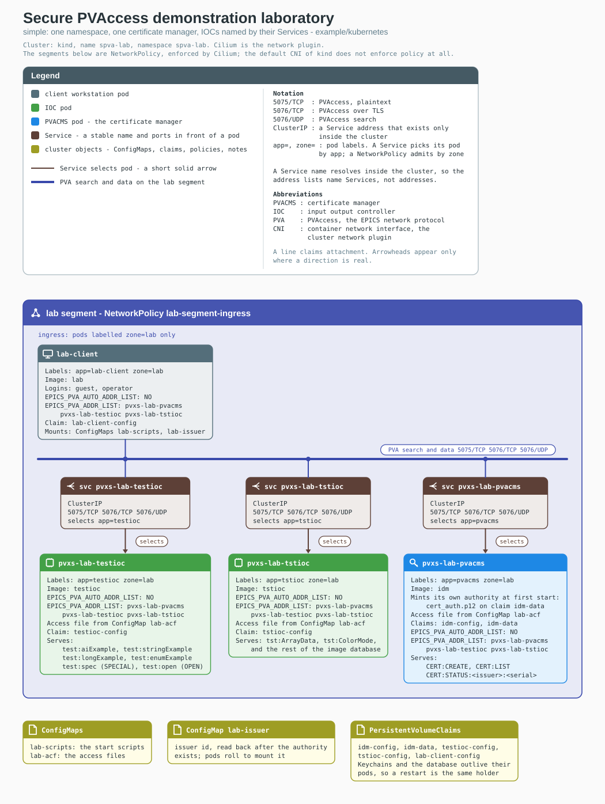
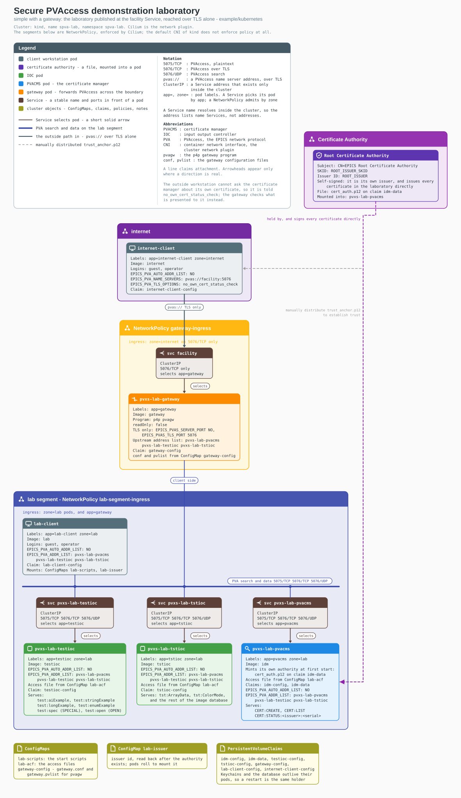
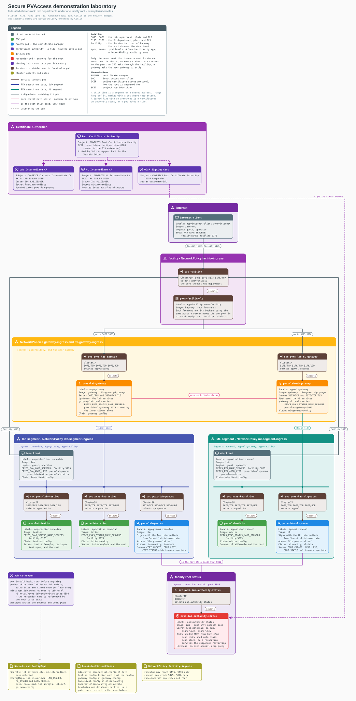
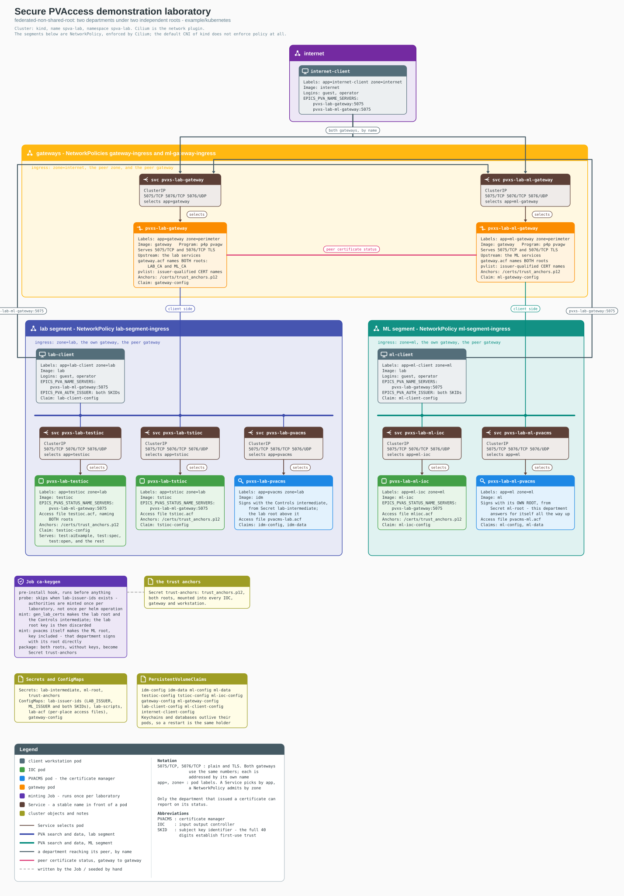

# Kubernetes: Secure PVAccess demonstration laboratories

Four self-contained laboratories that demonstrate Secure PVAccess: 
- certificates: *requested*, *approved*, *presented*, *verified*, and *revoked* 
- between: *IOC*s, *PVACMS*s, *gateways*, and *workstations*
- running as:  *Kubernetes objects* in one local cluster.

These are the same four laboratories as [`example/podman`](../podman/README.md), rendered in Kubernetes.

## The four laboratories

| Part | Topology                    | What it demonstrates                                                                                       |
| ---- | --------------------------- | ---------------------------------------------------------------------------------------------------------- |
| 1    | `simple`                    | One department. Certificates issued, approved, presented; access rules deciding who may write              |
| 2    | `simple-with-gateway`       | A gateway on a boundary that carries TLS alone, and a workstation on the internet that starts with nothing |
| 3    | `federated-shared-root`     | Two departments under one facility root; revocation of a department's authority, and of the root itself    |
| 4    | `federated-non-shared-root` | Two departments under two independent roots that share nothing; establishing trust with multiple roots     |

## Installation

1. Install `kind`, `helm`, and `kubectl`, and a container runtime

*Linux*
   ```sh
   sudo dnf install -y helm kubernetes-client                                # Fedora, RHEL: kubectl is kubernetes-client
   sudo snap install helm --classic && sudo snap install kubectl --classic   # Debian, Ubuntu
   curl -Lo kind https://kind.sigs.k8s.io/dl/latest/kind-linux-amd64 \
       && chmod +x kind && sudo mv kind /usr/local/bin/                      # any Linux; -arm64 on arm
   ```

*MacOS*

Use Docker Desktop on macOS, but install kind and helm

   ```sh
   brew install kind helm kubectl                               # macOS
   ```

	   Note: If Docker is absent podman can serve as the runtime: install it as the podman
	   README describes, and the helpers will fall back to it automatically.

2. On Linux with the cluster on podman, allow containers to outlive your login
   session. The cluster is itself a rootless container, and without this it is
   killed when you log out or your connection drops:
   ```sh
   loginctl enable-linger "$USER"
   ```

3. Get the source. The four repositories must be checked out as siblings, and the
   directory names must match the ones shown, because the image builds reference them
   by name:

   ```sh
   mkdir -p ~/spva && cd ~/spva
   B=scratch/fy26-four-topologies
   git clone -b $B --recurse-submodules https://github.com/spva-epics/pvxs-cms.git       pvxs-cms
   git clone -b $B --recurse-submodules https://github.com/spva-epics/pvxs-tls.git       pvxs
   git clone -b $B --recurse-submodules https://github.com/spva-epics/epics-base-tls.git epics-base
   git clone -b $B --recurse-submodules https://github.com/spva-epics/p4p-tls.git        p4p
   ```

4. Create the cluster:

   ```sh
   cd pvxs-cms/example/kubernetes
   . ./helpers.sh
   kind_create
   ```

   `kind_create` builds a one-node cluster named `spva-lab` with the default network
   plugin turned off, then installs Cilium.  
   
	   The segments in every laboratory are NetworkPolicy mediated, and the default 
	   CNI plugin of `kind` does not enforce policy at all so we need to use Cilium or 
	   Calico that does.

5. Build the images.  The build compiles EPICS Base, pvxs, and pvxs-cms from the
   sibling checkouts, so the first run takes a while. `JOBS` limits compiler
   processes; each can take most of a gigabyte:

   ```sh
   kbuild_images                # JOBS=2 kbuild_images on a machine with little memory
   ```

**Note**: The images and build scripts are shared with the podman examples so you don't have to do this twice.  Do either here or there.

6. Load the images into the cluster, which has no access to the runtime's image
   store:

   ```sh
   kload_images
   ```

   With the cluster on Docker, the two images that are pulled rather than built
   (haproxy and kubectl) are fetched by the cluster on first use instead.

## Start a topology scenario

- `kreset_topology` resets and builds a laboratory from the images & reads that laboratory's authority identifiers into your shell.


```sh
kreset_topology                        # lists the four laboratories and describes each
kreset_topology federated-shared-root  # brings it up, verifies it, and reads its authorities
```


To take a laboratory away:

```sh
kreset_topology clear             # the laboratory; the cluster stays
kreset_topology clear --cluster   # the cluster too
```

## Certificate Authorities

Environment variables are set automatically by `reset_topology`
- `$LAB`  `$LAB_SKID` - lab issuer ID and lab issuer SKID (Lab CA)
- `$ML`  `$ML_SKID` - lab issuer ID and lab issuer SKID (ML CA)
- `$ROOT` `ROOT_SKID` - If lab is an intermediate CA then this is its Root CA's ID and SKID 

### Run commands
Use `krun_in` to run commands in a particular place as a particular user with or without a certificate.

```
krun_in <place> as <person> [without a certificate] [--show] <command...>
```

| Place                         | Description                                                     |
| ----------------------------- | --------------------------------------------------------------- |
| `lab`, `ml`                   | a workstation inside a department                               |
| `internet`                    | a workstation on the internet, reachable only across a boundary |
| `lab-pvacms`, `ml-pvacms`     | a department's PVACMS                                           |
| `testioc`, `tstioc`, `ml-ioc` | an IOC                                                          |
| `gateway`, `ml-gateway`       | a department's boundary gateway                                 |

| People       | Available Places          |
| ------------ | ------------------------- |
| `admin`      | `lab-pvacms`, `ml-pvacms` |
| `operator`   | `lab`, `ml`, `internet`   |
| `guest`      | `lab`, `ml`, `internet`   |
| `testioc`    | `testioc`                 |
| `tstioc`     | `tstioc`                  |
| `ml-ioc`     | `ml-ioc`                  |
| `gateway`    | `gateway`                 |
| `ml-gateway` | `ml-gateway`              |

- `without a certificate` runs the same person presenting nothing.
- `--show` prints the `kubectl` command that would run, without running it.

```sh
krun_in lab as guest without a certificate --show pvxmonitor tst:ArrayData                                                                                                                                                      # kubectl -n spva-lab exec -it deploy/lab-client -- su - guest -c '
# source ~/.guest_bashrc 2>/dev/null
# unset EPICS_PVA_ADDR_LIST EPICS_PVA_AUTO_ADDR_LIST EPICS_PVA_NAME_SERVERS EPICS_PVA_TLS_OPTIONS
# [ -r /tmp/.pva-pod-env ] && . /tmp/.pva-pod-env
# export EPICS_PVA_TLS_KEYCHAIN=${HOME}/.config/pva/1.5/client.p12
# export EPICS_PVA_TLS_KEYCHAIN=
# 
# export PVXS_LOG=${PVXS_LOG:-none}
# pvxmonitor tst:ArrayData '
```

With no command, `krun_in` opens a shell as the given user in that place.

```sh
krun_in lab-pvacms as admin
#   [admin@lab-pvacms] > pvxcert -l
#   [admin@lab-pvacms] > exit
```

Simulation status.
- `klab_status` shows what is running.

### Controlling the OCSP responder
For `federated-shared-root` only:
- `kocsp_responder` reports what facility root's OCSP responder is reporting about the root certificate status
- `kocsp_responder unreachable` makes the OCSP responder unreachable
- `kocsp_responder reachable` restores reachability of the OCSP responder
- `kocsp_responder revoke root` reports that the facility's root certificate has been revoked

### Restarting IOCs, k8s Pods, and k8s Services

```sh
krestart testioc            # restart the softIoc alone, inside the running pod
krestart testioc pod        # delete the pod; the Deployment replaces it
krestart testioc service    # restart the Deployment behind the Service
```

	The K8s Service always keeps its address.   
	The keychains are stored on k8s PVCs (Persistent Volume Claims) which survive Pod restarts.

### Everything, Everywhere, All at once!

```sh
kgo_tls                     # copy trust anchors to everything outside the lab
                            # issue and approve certificates everywhere PVs are served
                            # restart IOCs and gateways to make them take effect all at once
kcopy_anchor                # physically copy the trust anchor to the internet zone workstation
```
 
---

## General configuration

| What                   | Where                                                                                                                           |
| ---------------------- | ------------------------------------------------------------------------------------------------------------------------------- |
| Workstation keychain   | `/home/<user>/.config/pva/1.5/client.p12`                                                                                       |
| IOC keychain           | `/home/<svc>/.config/pva/1.5/server.p12`                                                                                        |
| Gateway keychain       | `/home/gateway/.config/pva/1.5/gateway.p12`                                                                                     |
| Administrator keychain | `/home/idm/.config/pva/1.5/admin.p12`                                                                                           |
| CA keychain            | `/etc/pvacms/cert_auth.p12` when installed at start; beside the database when PVACMS mints its own                              |
| Trust anchor           | `trust_anchor.p12`, beside the CA keychain                                                                                      |
| Certificate database   | `/home/idm/.local/share/pva/1.5/certs.db`, on a PersistentVolumeClaim                                                           |
| Issuer id              | `/etc/epics/issuer`                                                                                                             |
| PVACMS access file     | `/etc/pvacms/pvacms.acf`                                                                                                        |
| Ports                  | `5075/TCP` plaintext, `5076/TCP` TLS, `5076/UDP` search (`5175`/`5176` at the facility Service for the ML department in Part 3) |
| Namespace              | `spva-lab`                                                                                                                      |
| Addresses              | Specified as Service names ; a Service name resolves inside the cluster, so `EPICS_PVA(S)_ADDR_LIST` names Services             |

## Part 1: simple

### Deploy 

| Place                | Conf                       | Value                                              | Description                            |
| -------------------- | -------------------------- | -------------------------------------------------- | -------------------------------------- |
| lab workstation, IOC | `EPICS_PVA_AUTO_ADDR_LIST` | `NO`                                               | finds IOCs by `EPICS_PVA(S)_ADDR_LIST` |
|                      | `EPICS_PVA_ADDR_LIST`      | `pvxs-lab-pvacms pvxs-lab-testioc pvxs-lab-tstioc` |                                        |
|                      |                            |                                                    |                                        |

```sh
kreset_topology simple
```

[](https://raw.githubusercontent.com/spva-epics/pvxs-cms/fy26-integration-testing/example/kubernetes/topology/topology-simple.svg)
The reset also prints `$ROOT` and `$ROOT_SKID`, the CA issuer ID and SKID and exports both into your shell.  As a convenience
we add the full identifier in `/etc/epics/issuer`.


## 1. Authorization

Reading is permitted everywhere in this lab:

```sh
krun_in lab as guest without a certificate pvxget test:aiExample
#   value double = 10 ...
krun_in lab as guest without a certificate pvxput test:stringExample hello
#   ERROR ... Put not permitted
```

**Issue certificates, approve, and restart services.** Do it all at once with `kgo_tls`:

```sh
kgo_tls
# ==> asking for certificates inside the laboratory
#     lab      7680fd57:9543760797533644244
#     lab      7680fd57:7037933793904719043
#     testioc  7680fd57:16731642807076057207
#     tstioc   7680fd57:163946842145459274
# ==> approving them
#   7680fd57:00163946842145459274  done
#   7680fd57:09543760797533644244  done
#   7680fd57:16731642807076057207  done
#   7680fd57:07037933793904719043  done
# ==> restarting what now holds one
# ==> no workstation outside this laboratory; done
```

Now create user certificates

```sh
krun_in lab as guest    authnstd -u client
krun_in lab as operator authnstd -u client
krun_in lab-pvacms as admin pvxcert --review-pending --all approve --yes
```

Now the access rules decide, and they distinguish people:

```sh
krun_in lab as operator pvxput test:spec 3     # written: SPECIAL grants operators
krun_in lab as guest    pvxput test:spec 3     # refused: guest is not an operator
krun_in lab as guest    pvxput test:open 3     # written: OPEN grants any holder
```

`test:open` is the rule worth reading twice: it names no user group at all. Its
condition is only that a certificate was presented over TLS and chains to the
laboratory's authority.

**THE DIFFERENCE.** After the manager mints its authority, the issuer identifier is
read back into ConfigMap `lab-issuer` and every Deployment is rolled to mount it, and
the reset then confirms the identifier has actually reached a workstation before
declaring the laboratory up. A rollout reporting finished means the new pod is running,
not that the file it mounts has caught up, and everything after that point asks for
certificates from an authority named by that file.

## Part 2: simple, with a gateway

| Place           | Conf                       | Value                                              | Description                                   |
| --------------- | -------------------------- | -------------------------------------------------- | --------------------------------------------- |
| internet        | `EPICS_PVA_AUTO_ADDR_LIST` | `NO`                                               |                                               |
|                 | `EPICS_PVA_NAME_SERVERS`   | `pvas://facility:5076`                             | ingress TLS scheme port-mapped to lab gateway |
|                 | `EPICS_PVA_TLS_OPTIONS`    | `no_own_cert_status_check`                         | disable checking own cert status              |
| lab workstation | `EPICS_PVA_ADDR_LIST`      | `pvxs-lab-pvacms pvxs-lab-testioc pvxs-lab-tstioc` |                                               |
| IOC             | `EPICS_PVA_ADDR_LIST`      | `pvxs-lab-pvacms pvxs-lab-testioc pvxs-lab-tstioc` |                                               |
| gateway         | conf                       | `EPICS_PVAS_SERVER_PORT: NO`                       | gateway allows only TLS traffic               |
|                 | pvlist                     | unqualified `test:`, `tst:`, `CERT:` names         |                                               |

[](https://raw.githubusercontent.com/spva-epics/pvxs-cms/fy26-integration-testing/example/kubernetes/topology/topology-simple-with-gateway.svg)

Part 1, plus a boundary. The gateway serves TLS and nothing else
(`EPICS_PVAS_SERVER_PORT: "NO"`), a Service named `facility` in front of it is the one
name the outside knows, and only the secure port is published through it. The outside
workstation starts holding nothing.

```sh
kreset_topology simple-with-gateway
```

Provision everything:

```sh
kgo_tls
```

```
==> asking for certificates inside the laboratory
    lab      bc8fc42c:15972558760514836878
    lab      bc8fc42c:2389177307031252657
    testioc  bc8fc42c:13492779153098257798
    tstioc   bc8fc42c:5833605055436574197
    gateway  bc8fc42c:9542026983815967809
==> approving them
  bc8fc42c:09542026983815967809  done
  bc8fc42c:13492779153098257798  done
  bc8fc42c:02389177307031252657  done
  bc8fc42c:05833605055436574197  done
  bc8fc42c:15972558760514836878  done
==> restarting what now holds one
==> copying the trust anchor to the workstation outside
    copied to guest
    copied to operator
==> waiting for the gateway to serve the internet
==> asking for a certificate from the internet, across the gateway
Certificate identifier  : bc8fc42c:3451527697326035254
  bc8fc42c:03451527697326035254  done
==> reading across the gateway
    the gateway is open to a holder with a valid certificate
```

The trust anchor is copied by hand to the internet workstation. The internet workstation then requests its own identity
across the boundary as `guest` user.

```sh
krun_in internet as guest pvxput test:stringExample 9   # refused: DEFAULT grants no write
krun_in internet as guest pvxput test:spec 9            # refused: SPECIAL wants an operator
krun_in internet as guest pvxput test:open 9            # written
krun_in internet as guest pvxget test:open              # value double = 9
```

**Why no own-cert status check**:
	A holder	normally establishes the operational status of its own certificate before using it.  This
	workstation cannot: the PVACMS is on the other side of a gateway that
	requires an already validated certificate to traverse - chicken and egg.  So we disable that check
	knowing that the gateway will act responsibly and check our certificate status before allowing us through.


## Part 3: federated, one facility root

| Place | Conf | Value | Description |
|---|---|---|---|
| internet | `EPICS_PVA_NAME_SERVERS` | `facility:5075 facility:5175` | the port chooses the department |
| lab / ml workstation | `EPICS_PVA_ADDR_LIST` | its own department's Services | |
| | `EPICS_PVA_NAME_SERVERS` | `facility:5175` / `facility:5075` | each names the peer department |
| IOC | `EPICS_PVAS_STATUS_NAME_SERVERS` | `facility:5175` / `facility:5075` | only the issuing department can report a certificate's status |
| gateway | conf | `serverport 5075`/`5175`, TLS `5076`/`5176` | |
| | conf | `EPICS_PVAS_STATUS_NAME_SERVERS: pvxs-lab-ml-gateway:5175` / `pvxs-lab-gateway:5075` | the peer gateway, named directly |
| | pvlist | `CERT:` names qualified by issuer | |

[](https://raw.githubusercontent.com/spva-epics/pvxs-cms/fy26-integration-testing/example/kubernetes/topology/topology-federated-shared-root.svg)

Two departments under one facility root. Each has its own certificate manager signing
with its own intermediate, its own IOCs and workstation, and its own gateway. A
department reaches its peer through the `facility` Service, where the port chooses the
department: 5075 and 5076 reach the lab, 5175 and 5176 reach the ML department. The
root itself is answered for by a responder, because a root has no status process
variable of its own.

```sh
kreset_topology federated-shared-root
```

```
    the responder answers for the facility root
    each certificate manager answers its administrator
    reading works, from each department and from outside
    a write with no certificate is refused, by the IOC and at the boundary
```

The reset exports `$LAB`, `$ML`, `$LAB_SKID`, and `$ML_SKID`.

**The authorities are minted before anything starts.** A pre-install Job runs
`gen_lab_certs` once: a facility root, an intermediate for each department, and the
responder's material. Each manager's Secret holds only its own intermediate; the root's
key is never packaged at all. The Job is guarded so that it mints once per laboratory,
not once per helm operation; an upgrade that re-minted authorities mid-life would leave
the managers signing with roots that nothing else still trusts.

Issue certificates in both departments and approve each on the manager that issued it:

```sh
krun_in lab as guest    authnstd -u client
krun_in ml  as guest    authnstd -u client
krun_in testioc as testioc authnstd -u ioc
krun_in tstioc  as tstioc  authnstd -u ioc
krun_in ml-ioc  as mlioc   authnstd -u ioc
krun_in gateway    as gateway authnstd -u ioc
krun_in ml-gateway as gateway authnstd -u ioc
krun_in lab-pvacms as admin pvxcert --review-pending --all approve --yes
krun_in ml-pvacms  as admin pvxcert --review-pending --all approve --yes
```

Cross the departments as identified peers. The chain each side is shown names the
facility root above the peer's intermediate:

```sh
krun_in lab as operator pvxinfo -v ml:aiExample | grep '^#'
# TLS x509:<serial>:EPICS Root Certificate Authority -> EPICS ML Intermediate CA/gateway@...
krun_in ml as guest pvxput test:open 31        # written, across the boundary
```

**Only the department that issued a certificate can report on its status.** Every
status route therefore crosses to the peer: an IOC asks through the facility's peer
port (`EPICS_PVAS_STATUS_NAME_SERVERS: facility:5175` on a lab IOC), and a gateway asks
the peer gateway directly, a setting read by its inner status client alone so nothing
else is given the route.

### Revoke a department's authority

The ML administrator revokes their own intermediate, and nobody else can:

```sh
krun_in ml-pvacms as admin pvxcert -R "${ML}:00000000009876543213"
```

Within seconds, every ML holder reports `AUTHORITY_REVOKED`, the word that says the
fault is above the holder: their own certificates were never touched, and asking the
same authority for another one would not help. The lab department is untouched:

```sh
krun_in ml  as guest    pvxcert -f /home/guest/.config/pva/1.5/client.p12    # AUTHORITY_REVOKED
krun_in lab as operator pvxcert -f /home/operator/.config/pva/1.5/client.p12 # VALID
```

The ML manager's own service certificate is signed by the revoked intermediate too, so
its secure port goes with it, and its administrator tooling stops answering.

### Revoke the facility root

```sh
kocsp_responder revoke root
#   the facility root is REVOKED
```

The responder now answers `revoked` for the root, and within one responder validity
window both departments degrade, because everything either of them issued chains to it:

```sh
krun_in ml  as guest pvxcert -f /home/guest/.config/pva/1.5/client.p12   # AUTHORITY_REVOKED
krun_in lab as guest pvxcert -f /home/guest/.config/pva/1.5/client.p12   # AUTHORITY_REVOKED
```

A root's revocation is terminal, and there is no command that puts it back:
`kreset_topology federated-shared-root` mints new authorities, which is what recovery
means in a real facility as well.

## Part 4: federated, two independent roots

| Place                | Conf                             | Value                                                | Description                                                |
| -------------------- | -------------------------------- | ---------------------------------------------------- | ---------------------------------------------------------- |
| internet             | `EPICS_PVA_NAME_SERVERS`         | `pvxs-lab-gateway:5075 pvxs-lab-ml-gateway:5075`     | no facility: each gateway by its own name                  |
| lab / ml workstation | `EPICS_PVA_ADDR_LIST`            | its own department's Services                        |                                                            |
|                      | `EPICS_PVA_NAME_SERVERS`         | `pvxs-lab-ml-gateway:5075` / `pvxs-lab-gateway:5075` |                                                            |
|                      | `EPICS_PVA_AUTH_ISSUER`          | both SKIDs                                           | two roots, so first-use trust needs both whole identifiers |
| IOC                  | `EPICS_PVAS_STATUS_NAME_SERVERS` | `pvxs-lab-ml-gateway:5075` / `pvxs-lab-gateway:5075` |                                                            |
| gateway              | conf                             | `gateway.acf` names `LAB_CA` and `ML_CA`             |                                                            |
|                      | pvlist                           | `CERT:` names qualified by issuer                    |                                                            |

[](https://raw.githubusercontent.com/spva-epics/pvxs-cms/fy26-integration-testing/example/kubernetes/topology/topology-federated-non-shared-root.svg)

Two departments under two roots that share nothing. There is no facility above them: no
load balancer, no responder, no common ancestor. Each gateway is addressed by its own
name, both serve 5075 and 5076, and trust crosses only because every keychain holds
both roots as anchors: one identity, many anchors.

```sh
kreset_topology federated-non-shared-root
```

The minting Job differs to match: `gen_lab_certs` mints the lab root and the Controls
intermediate and then discards the lab root's key; the ML root is minted by `pvacms`
itself, exactly as a first start would, and that department signs with its root
directly; both roots, without keys, are packaged as Secret `trust-anchors` and mounted
into every IOC, gateway, and workstation at `/certs/trust_anchors.p12`.

**Anchors first, identities second.** A user establishes trust before asking for
anything, naming both authorities by their whole identifiers:

```sh
krun_in ml  as guest    authnstd --trust-anchor --issuer "${LAB_SKID} ${ML_SKID}"
krun_in lab as operator authnstd --trust-anchor --issuer "${LAB_SKID} ${ML_SKID}"
```

The whole 40-digit identifier is required for first-use trust, and the tool refuses the
short form with an explanation when the authority is not already held. After the
anchors are in place the short form is enough to choose between them:

```sh
krun_in ml  as guest    authnstd -u client --issuer "${ML}"
krun_in lab as operator authnstd -u client --issuer "${LAB}"
```

Approve on each manager, restart the holders, and trust crosses roots that share
nothing. Each side accepts a chain ending in a root its own department never issued,
because the anchor list says to:

```sh
krun_in ml as guest pvxinfo -v test:aiExample | grep '^#'
# TLS x509:...:EPICS Lab Root Certificate Authority -> EPICS Controls Intermediate CA/gateway@...
krun_in ml as guest pvxput test:open 41        # written
krun_in ml as guest pvxput test:spec 9         # refused: operators only
```

**The access files are part of the topology.** The gateways and IOCs mount access files
naming both roots (`AUTHORITY(LAB_CA, ...)`, `AUTHORITY(ML_CA, ...)`) over the ones
baked into the images, which name Part 3's shared root. A rule naming an authority that
does not exist matches no holder, and every write is refused with nothing looking
wrong.

## When something goes wrong

- **A cross-boundary read times out right after provisioning.** A gateway makes its
  upstream connections when it starts and does not retry the ones it could not make.
  Restart the gateways after the IOCs are serving: `kubectl -n spva-lab rollout restart
  deploy/pvxs-lab-gateway`, or run `kreset_topology`, which does this for you.
- **Everything reads but nothing writes, through a gateway.** Check `"readOnly": false`
  is present in the gateway's configuration, and check the writer actually holds an
  identity: a keychain holding only an anchor reads fine and fails every write, because
  a gateway forwards reads regardless and the holder is anonymous.
- **`no certificate manager answered CERT:CREATE:...`.** The issuer identifier in the
  requesting pod does not match the authority that is actually serving. In Part 1 style
  laboratories the identifier is distributed after the authority exists; make sure the
  reset completed, and re-source `helpers.sh` if it is stale in your shell.
- **The laboratory appears to work but the boundary checks fail.** The cluster has no
  policy-enforcing network plugin, so every NetworkPolicy is silently ignored. Build
  the cluster with `kind_create`, which installs Cilium.
- **A reset hangs.** Do not delete PersistentVolumeClaims while pods still mount them;
  the deletion waits forever. `kreset_topology` takes the workloads down first and
  bounds every wait, so prefer it over hand-rolled cleanup.
- **Watching the traffic.** Hubble shows flows with pod identity:
  `kubectl -n kube-system exec ds/cilium -c cilium-agent -- hubble observe --pod
  spva-lab/internet-client`. One line per flow, named at both ends; it answers "who
  actually connected to whom" in seconds.

## The files

| Path | What it is |
|---|---|
| `helpers.sh` | The commands: `kreset_topology`, `krun_in`, `krestart`, `kgo_tls`, `kcopy_anchor`, `kocsp_responder`, `klab_status`, `klab_ids`, `kind_create`, `kload_images` |
| `kind-cluster.yaml` | The cluster: one node, default network plugin off |
| `helm/simple` | Part 1 chart |
| `helm/simple-with-gateway` | Part 2 chart |
| `helm/federated-shared-root` | Part 3 chart, including the minting Job and the responder |
| `helm/federated-non-shared-root` | Part 4 chart, including the two-root minting Job |
| `helm/*/files/` | Start scripts and access files, taken verbatim from the podman topology so the two stay in step |
| `topology/` | The four diagrams and the scripts that draw them |
| `docker/` | The image definitions, shared with and built by the podman example |
