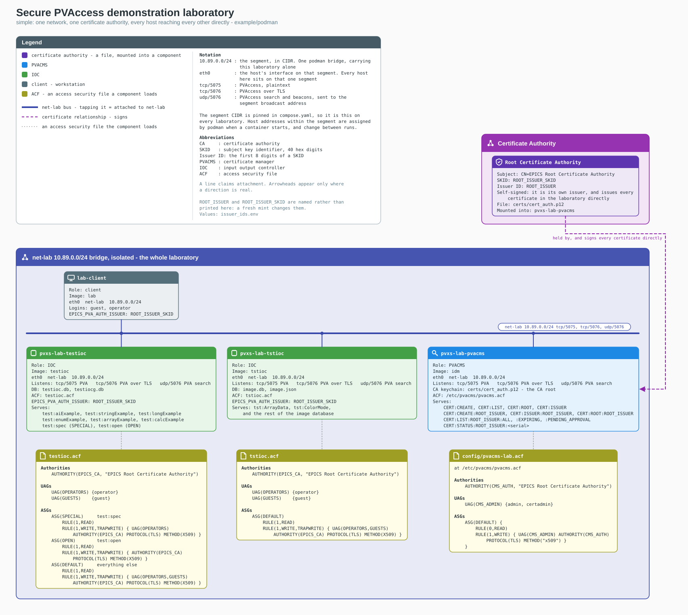
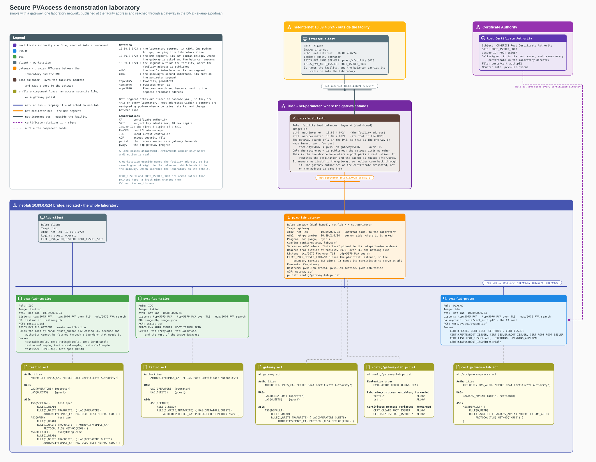
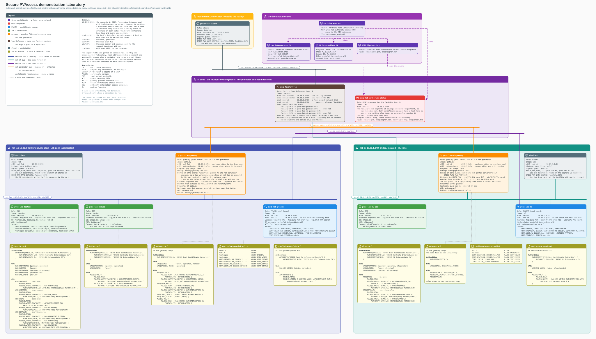
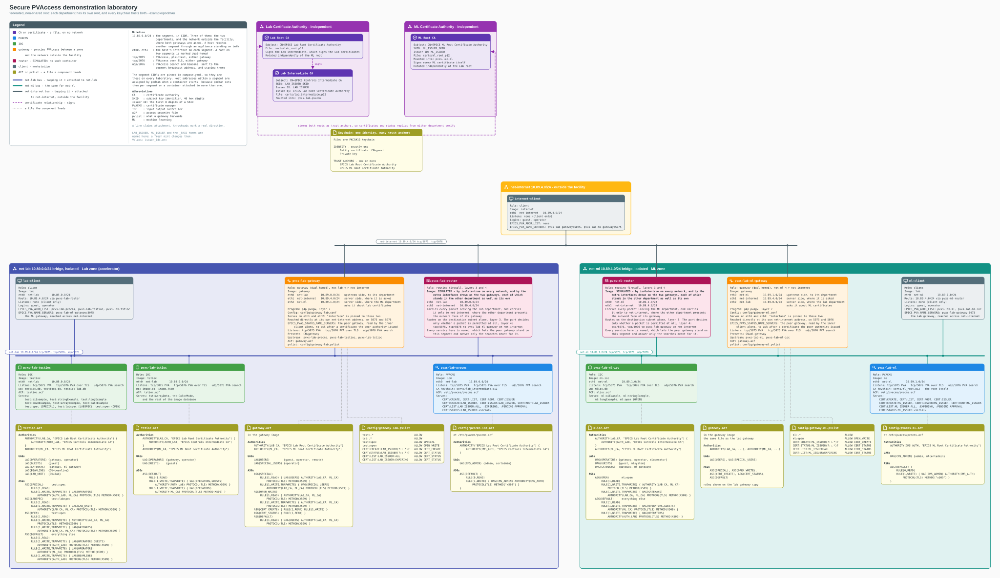

# Secure PVAccess demonstration laboratories

This example builds four containerized laboratories that demonstrate Secure PVAccess:
certificate issuance and management with PVACMS (the PVAccess Certificate Management
System), authorization with access control files, network isolation, gateways, and two
federation models. Each laboratory runs under rootless podman: on Linux, on macOS
inside a podman machine, or on Windows inside WSL2 (the Windows Subsystem for Linux).

## Contents

- [What this example demonstrates](#what-this-example-demonstrates)
- [The four laboratories](#the-four-laboratories)
- [Installation](#installation)
- [Start a laboratory](#start-a-laboratory)

**[Part 1 - simple](#part-1---simple)**
- [1. Authorization](#1-authorization)
- [2. Certificate request identifiers](#2-certificate-request-identifiers)
- [3. List certificates](#3-list-certificates)
- [4. Administrative authorization](#4-administrative-authorization)

**[Part 2 - simple, with a gateway](#part-2---simple-with-a-gateway)**
- [5. External access through a gateway](#5-external-access-through-a-gateway)
- [Nothing crosses the boundary yet](#nothing-crosses-the-boundary-yet)
- [Issue the laboratory's certificates, the gateway among them](#issue-the-laboratorys-certificates-the-gateway-among-them)
- [Carry the authority to the workstation](#carry-the-authority-to-the-workstation)
- [Ask for an identity over TLS](#ask-for-an-identity-over-tls)
- [6. Identity across a gateway](#6-identity-across-a-gateway)
- [Revocation cuts a connection that is already up](#revocation-cuts-a-connection-that-is-already-up)

**[Part 3 - federated, one facility root](#part-3---federated-one-facility-root)**
- [Addressing and network layout](#addressing-and-network-layout)
- [Baseline behavior without certificates](#baseline-behavior-without-certificates)
- [7. One PVACMS per department](#7-one-pvacms-per-department)
- [Issue the certificates](#issue-the-certificates)
- [8. Cross-department trust under a shared root](#8-cross-department-trust-under-a-shared-root)
- [9. Revocation at the issuing department](#9-revocation-at-the-issuing-department)
- [The OCSP responder for the facility root](#the-ocsp-responder-for-the-facility-root)
- [When the responder is unreachable](#when-the-responder-is-unreachable)
- [Revoke a department's authority](#revoke-a-departments-authority)
- [10. Revoke the facility root](#10-revoke-the-facility-root)

**[Part 4 - federated, two independent roots](#part-4---federated-two-independent-roots)**
- [Network layout](#network-layout)
- [11. Two independent roots](#11-two-independent-roots)
- [12. One identity, multiple trust anchors](#12-one-identity-multiple-trust-anchors)
- [Issue the remaining certificates](#issue-the-remaining-certificates)
- [13. Cross-department verification](#13-cross-department-verification)
- [14. Authorization by issuing authority](#14-authorization-by-issuing-authority)

**[Reference](#reference)**
- [Container layout](#container-layout)
- [Filter the certificate listing](#filter-the-certificate-listing)
- [Troubleshooting](#troubleshooting)
- [Reset between demonstrations](#reset-between-demonstrations)

## What this example demonstrates

| | |
|---|---|
| **Authorization** | A certificate distinguishes reading from writing, the group it places the holder in decides which variables the holder can write, and revocation takes effect immediately. Part 1 demonstrates this on one network segment, where no other component can affect the result |
| **Out-of-band trust establishment** | A certificate authority's full identifier, or the authority certificate itself, must reach a holder over a channel that the laboratory does not control. Part 1 distributes an identifier by hand; Part 4 stores two authorities in one keychain, and an ordinary certificate request adds to that set rather than replacing it |
| **Administration** | Anyone can list and filter certificates. Only an administrator sees request identifiers, approves or denies requests, and revokes certificates, with one exception: a holder can revoke their own certificate |
| **Network isolation** | Each laboratory uses one to five podman networks, each isolated from the others. A PVACMS instance cannot be reached from outside its own segment even by address, and discovery and name resolution also stop at segment boundaries |
| **Gateways** | A gateway is the only path across a network boundary, enforced by network isolation rather than by configuration. A request that crosses is authorized twice: at the gateway against your certificate, and at the input/output controller (IOC) against the gateway's certificate. Parts 2, 3, and 4 |
| **Federation** | Part 3 places two departments under one facility root, so every node trusts a certificate from either department and only the issuing department can revoke it. Part 4 gives each department its own root and stores both roots in every keychain, so trust comes from the trust anchor list rather than from a shared chain, and each gateway is addressed by its own name |
| **Authorization by department** | Under a shared root, a rule names the organizational unit that the issuing department vouched for (Part 3). Under independent roots, a rule names the authority itself, because each root is a department (Part 4) |
| **Authority revocation** | Revoking a department's intermediate authority, by that department's own administrator, stops that department and no other. The facility root has no status channel of its own, so it names a status responder. A revoked authority anywhere in the chain, at any depth, makes every certificate beneath it report `AUTHORITY_REVOKED` rather than claiming its own revocation, which says the fault is above the holder and where to go and look for it. Part 3 |

## The four laboratories

This example builds four laboratories from the same images. Each laboratory has its own
diagram and its own part of the walkthrough, and no test appears twice.

| Laboratory | Walkthrough | Description |
|---|---|---|
| [`simple`](https://raw.githubusercontent.com/slac-epics/pvxs-cms/fy26-integration-testing/example/podman/topology/topology-simple.svg) | Part 1 | One segment, one self-signed authority, no boundary to cross |
| [`simple-with-gateway`](https://raw.githubusercontent.com/slac-epics/pvxs-cms/fy26-integration-testing/example/podman/topology/topology-simple-with-gateway.svg) | Part 2 | One laboratory, published at a facility address and reached through a gateway that carries TLS alone |
| [`federated-shared-root`](https://raw.githubusercontent.com/slac-epics/pvxs-cms/fy26-integration-testing/example/podman/topology/topology-federated-shared-root.svg) | Part 3 | Two departments under one facility root, with a status responder for the root |
| [`federated-non-shared-root`](https://raw.githubusercontent.com/slac-epics/pvxs-cms/fy26-integration-testing/example/podman/topology/topology-federated-non-shared-root.svg) | Part 4 | Two departments under two independent roots, with both roots in every keychain |

Each diagram is a complete map of its laboratory: every network segment, every service,
the certificate authorities with their issuer identifiers, and the full text of every
access control file and gateway `pvlist`. The diagrams are wide. To read them at full
size, click a diagram to open the raw file, which the browser renders zoomable.

<!-- These are absolute raw.githubusercontent.com addresses: GitHub's in-page navigation
fails on a relative link with ?raw=true, showing an error page instead of following the
redirect. Absolute means the branch is hardcoded - update it here when this work moves
off scratch/fy26-four-topologies. -->

## Installation

1. Install podman. The image build scripts call `docker`, so install the shim as well:

   ```sh
   sudo apt install -y podman podman-compose podman-docker      # Debian, Ubuntu
   sudo dnf install -y podman podman-compose podman-docker      # Fedora, RHEL
   brew install podman podman-compose                           # macOS
   ```

   On macOS, podman runs the containers inside a Linux virtual machine. Create the
   machine with enough processors and memory for the source build, then start it:

   ```sh
   podman machine init --cpus 4 --memory 8192 --disk-size 60
   podman machine start
   ```

   Homebrew has no `podman-docker` package, so give the build scripts a `docker`
   command by linking it to podman:

   ```sh
   ln -s "$(command -v podman)" "$(brew --prefix)/bin/docker"
   ```

   The laboratory is routinely tested on Linux. On macOS the same containers and
   isolated networks run inside the virtual machine, but this path is less tested.

   On Windows, run the laboratory inside WSL2 (the Windows Subsystem for Linux).
   There is no native path: podman ships a Windows client, but the laboratory is
   driven by bash scripts, which PowerShell and cmd cannot run. Install an Ubuntu or
   Fedora WSL2 distribution, then follow the Linux instructions inside it unchanged.
   Two caveats:

   - `loginctl enable-linger` requires systemd, so make sure the distribution has
     `systemd=true` in `/etc/wsl.conf` (the default on current Ubuntu WSL images).
   - Windows shuts the WSL2 virtual machine down a short while after the last shell
     closes, and linger does not prevent that. If the laboratory must survive closing
     the terminal, keep a WSL shell open.

2. On Linux, allow containers to outlive your login session. If you skip this step,
   rootless containers are killed when you log out or your connection drops:

   ```sh
   loginctl enable-linger "$USER"
   ```

   This step does not apply on macOS: the containers run inside the podman machine,
   which keeps running until you stop it with `podman machine stop`.

3. Get the source. The four repositories must be checked out as siblings, and the
   directory names must match the ones shown, because the image builds reference them
   by name:

   ```sh
   mkdir -p ~/slac && cd ~/slac
   B=scratch/fy26-four-topologies
   git clone -b $B --recurse-submodules https://github.com/slac-epics/pvxs-cms.git       pvxs-cms
   git clone -b $B --recurse-submodules https://github.com/slac-epics/pvxs-tls.git       pvxs
   git clone -b $B --recurse-submodules https://github.com/slac-epics/epics-base-tls.git epics-base
   git clone -b $B --recurse-submodules https://github.com/slac-epics/p4p-tls.git        p4p
   ```

## Start a laboratory

Two things do different jobs. `bootstrap.sh` builds the images, which is slow and runs
once. `reset_topology` builds a laboratory from the images, which takes a minute or two
and runs whenever you want a different laboratory or a clean one:

```sh
cd ~/slac/pvxs-cms/example/podman
source ./helpers.sh                   # defines reset_topology, run_in, and the rest
./bootstrap.sh                        # builds the images; issues no certificates
reset_topology                        # lists the four laboratories and describes each
reset_topology federated-shared-root  # brings it up, verifies it, and reads its authorities
```

`reset_topology` is a shell function rather than a script, and it has to be, because it
does two things that must not be separated: it runs `reset.sh` to build the laboratory,
and it then reads that laboratory's authority identifiers into your shell. Minting an
authority gives it a new identifier, and a shell still holding the old one goes on naming
an authority the laboratory no longer has, so every request reaches a name nothing
answers for. That reads as a broken laboratory when it is only a stale shell. Running
`reset.sh` by hand leaves you to remember `lab_ids` afterwards; `reset_topology` does not.

The image build compiles EPICS Base, pvxs, pvxs-cms, and p4p from source, which takes a
while. On a machine with limited memory, reduce the compiler parallelism and make sure
swap space is available:

```sh
JOBS=2 ./bootstrap.sh
```

Rebuilding leaves the images it replaced behind, and each build of this chain is several
gigabytes. Build it enough times and the next one stops with `no space left on device`,
which reads as a broken build rather than a full disk. Reclaim the ones nothing refers
to:

```sh
podman system df               # says how much is reclaimable
podman image prune -f          # removes the images nothing refers to
```

If you built the images before pulling new source, rebuild them. The process variables
and the access rules are baked into the images, so a pull on its own leaves an IOC
serving the old set and the examples in this document timing out:

```sh
git pull && JOBS=2 ./bootstrap.sh && reset_topology federated-shared-root
```

Certificate authorities belong to a laboratory rather than to the images, so `reset.sh`
creates them in `topologies/<name>/` and keeps existing ones unless you request new ones
with `--authorities`. It writes the issuer identifiers where compose and `helpers.sh`
read them.

### Run commands in the laboratory

Every command in this walkthrough runs inside a container, as a specific account, and
both facts matter to what is being demonstrated. Rather than repeating a long
`podman exec` line for each command, source the helper functions once:

```sh
source ./helpers.sh
```

This defines `run_in` and `reset_topology`, and reads the laboratory's issuer identifiers
into the shell: `$ROOT` where one authority issues everything, and `$LAB` and `$ML` where
each department has its own. Sourcing it again is harmless and re-reads the identifiers,
which is what `reset_topology` does for you after every reset.

```
run_in <place> as <person> [without a certificate] [--show] <command...>
```

| Place | Description |
|---|---|
| `lab`, `ml` | a workstation inside a department |
| `perimeter` | a workstation outside the departments, reachable only across a boundary |
| `lab-manager`, `ml-manager` | a department's PVACMS |
| `testioc`, `tstioc`, `ml-ioc` | an IOC |
| `gateway`, `ml-gateway` | a department's boundary gateway |

The people are real accounts on those machines: `guest` and `operator` on a workstation,
`admin` on a PVACMS, and a service's own account such as `testioc` or `gateway`.

To see the `podman exec` line that a command stands for, without running it, add
`--show`. This is how to adapt one of these examples to a real deployment:

```sh
run_in lab as guest --show pvxget test:aiExample
#   podman exec --user guest podman_lab-client_1 bash -lc '...'
```

With no command, `run_in` opens a shell in that place. You arrive as that account, with
the same environment a command would have had, and a prompt that names the account and
the place:

```sh
run_in lab-manager as admin
#   [admin@lab-manager] > pvxcert -l
#   [admin@lab-manager] > exit
```

Use a shell like this to answer interactive prompts, or to try several commands without
prefixing each with `run_in`. When scripting, pass the command as arguments instead:
piping commands into the shell does not work, because an interactive shell never reaches
the end of its input.

The other helper functions:

- `run_in` on its own lists the places and the accounts.
- `lab_status` shows what is running.
- `lab_ids` reads the issuer identifiers into the shell, and `lab_ids_show` prints them.
- `authority_says` reports what the facility root's status responder says about the
  root, and `authority_revoke`, `authority_restore`, `authority_unreachable`, and
  `authority_reachable` change the answer. These belong to Part 3, the one laboratory
  with a responder: the pair that stops and starts the responder is
  [When the responder is unreachable](#when-the-responder-is-unreachable), and the pair
  that changes the answer is section 10.

---

# Part 1 - simple

One segment, one self-signed authority held by PVACMS, two IOCs, and a workstation.
Nothing crosses a boundary because there is no boundary, so this laboratory shows what a
certificate does on its own.

```sh
reset_topology simple
```

[](https://raw.githubusercontent.com/slac-epics/pvxs-cms/fy26-integration-testing/example/podman/topology/topology-simple.svg)

The diagram is wide. To read every access rule and `pvlist` at full size, click the
diagram to open the raw file.

Nothing is issued for this laboratory before it starts. PVACMS finds no authority at its
configured location, creates a self-signed one there, and issues every certificate under
it. That is the whole hierarchy: one authority, and the certificates it signs.

## Distribute the trust anchor

An authority that PVACMS created itself has an identifier nobody chose, and no node may
trust an authority it learned about over the same channel it is trying to secure. Before
anyone can request a certificate, the identifier has to reach them another way.
`reset_topology` does this for you. It is worth doing by hand once, because it is what an
operator does when distributing trust to a machine the laboratory does not manage.

The authority is a keychain file that PVACMS wrote, and its identifier is that
certificate's subject key identifier:

```sh
run_in lab-manager as admin \
    openssl pkcs12 -in /home/idm/.local/share/pva/1.5/cert_auth.p12 -nokeys -passin pass: \
  | openssl x509 -noout -ext subjectKeyIdentifier
#   X509v3 Subject Key Identifier:
#       E3:7F:CF:9D:DF:0B:AC:65:D3:30:2B:4D:B5:88:71:F9:6E:E1:01:24
```

The tools expect the same digits without separators and in lowercase:

```sh
run_in lab-manager as admin bash -c \
  'openssl pkcs12 -in /home/idm/.local/share/pva/1.5/cert_auth.p12 -nokeys -passin pass: \
   | openssl x509 -noout -ext subjectKeyIdentifier | tail -1 | tr -d " :" | tr "A-F" "a-f"'
#   e37fcf9ddf0bac65d3302b4db58871f96ee10124
```

Different places need different forms of the identifier. `lab_ids` sets both in the
shell:

```sh
lab_ids
echo "${ROOT}"        # 39ed6dd4          names the authority where a name is needed
echo "${ROOT_SKID}"   # 39ed6dd4...  40   establishes trust in it, the first time
```

Both are variables in the shell you type in. The shell expands a command before sending
it into a container, so `"${ROOT_SKID}"` reaches the container as its value. Typing the
same expression inside a container's own shell finds nothing, because `lab_ids` set the
variable in the outer shell.

A holder needs all 40 digits the first time it makes a request, because eight digits are
not enough to decide which authority is meant. In this laboratory every container
receives the full identifier at start, in `/etc/epics/issuer`, which a login shell reads
back. The walkthrough therefore needs no further setup, and you can go straight to
section 1.

### Reference: give a holder the issuer identifier

> **Nothing in this subsection is part of the walkthrough. Do not run it here.** Each
> command replaces a keychain or removes something a later section depends on. It is
> documented because it is what an operator does for a machine the laboratory does not
> manage.

The identifier goes to the holder, so give it where the holder runs, which in this
laboratory means inside a container and therefore through `run_in`. There are three
ways, in increasing order of persistence:

- `authnstd -u client --issuer "${ROOT_SKID}"` supplies the identifier for that one
  request and keeps nothing.
- `EPICS_PVA_AUTH_ISSUER="${ROOT_SKID}"` supplies it to every request that the
  environment covers. This is how the containers here are configured, from
  `/etc/epics/issuer` at start.
- `authnstd --trust-anchor --issuer "${ROOT_SKID}"` fetches the authority and writes it
  into the keychain, answering `Trust Anchor retrieved`. Only this form leaves the
  holder needing no identifier again, and it replaces whatever the keychain held,
  renaming the old file aside.

Running more than one of these in turn demonstrates nothing: after a request succeeds,
the keychain holds a valid certificate and the next attempt stops with
`Valid certificate found: Use --force flag to overwrite`.

### Reference: hand over the authority certificate

> **Nothing in this subsection is part of the walkthrough either. Do not run it here.**
> It overwrites the workstation's keychain and removes the identifier that every later
> section relies on.

All three methods in the previous subsection tell a holder which authority to expect,
and the holder then fetches and stores it. For a machine the laboratory does not manage
there is a more direct route: put the authority certificate into its keychain yourself.
A holder whose keychain already contains the authority needs no identifier at all,
because there is nothing left to decide.

The file to hand over is the authority certificate with its private key removed, which
is what `authnstd --trust-anchor` produces. To make one with openssl, run these commands
on the PVACMS, which holds `/home/idm/.local/share/pva/1.5/cert_auth.p12`:

- `openssl pkcs12 -in cert_auth.p12 -nokeys -passin pass: -out root.pem` extracts the
  certificate and leaves the key behind.
- `openssl pkcs12 -export -nokeys -in root.pem -out trust_anchor.p12 -passout pass:`
  puts that certificate, and only it, into a keychain.
- `openssl pkcs12 -in trust_anchor.p12 -passin pass: -info -noout` must report one
  `Certificate bag` and no shrouded key bag. Verify this: a keychain that kept the key
  would hand out the power to issue certificates rather than the ability to trust them.

Put that file at the path the holder's `EPICS_PVA_TLS_KEYCHAIN` names, which for the
laboratory workstation is `/home/guest/.config/pva/1.5/client.p12`, and make it readable
by that user: `podman cp` it in and `chown guest`. From that moment,
`authnstd -u client` succeeds there with no `--issuer` and no `EPICS_PVA_AUTH_ISSUER`
set, and the certificate comes back issued under the authority you copied in. The
request keeps the authority and adds the holder's own identity beside it, so one file
ends up carrying both.

Both routes are safe for the same reason: the authority, or its identifier, reached the
holder over a path the laboratory does not depend on. Copying a file across is such a
path. Accepting an authority from whatever answered the request is not, which is why a
holder with neither refuses to make a request at all.

## 1. Authorization

Nothing holds a certificate yet, and the laboratory is already running. This is the
baseline to return to whenever something later looks broken.

**Reading needs nothing.** Both IOCs answer anyone on the segment:

```sh
run_in lab as guest without a certificate pvxget test:aiExample
#   value double = 10
run_in lab as guest without a certificate pvxget tst:ColorMode
#   value.index int32_t = 0
```

**Writing is refused, whatever you write to.** Every write rule in `testioc.acf` names
`PROTOCOL(TLS)` (Transport Layer Security) and `METHOD(X509)`, so with no certificate
nothing is writable:

```sh
run_in lab as guest without a certificate pvxput test:stringExample hello
#   ERROR ... Put not permitted
```

The refusal comes from the IOC itself. There is nowhere else it could come from: the
laboratory is one segment, and the holder is on it.

**Issue certificates.** Request one for each of two people and both IOCs, then approve
the four together:

```sh
run_in lab as guest    authnstd -u client
run_in lab as operator authnstd -u client
run_in testioc as testioc authnstd -u ioc
run_in tstioc  as tstioc  authnstd -u ioc

run_in lab-manager as admin pvxcert --review-pending --all approve --yes
```

An IOC reads its keychain when it starts, and both IOCs were already running when their
certificates arrived, so they keep serving plain traffic until restarted. Restart them,
or every write in this section is refused for a reason unrelated to the rule being
tested:

```sh
podman-compose -p podman -f topologies/simple/compose.yaml \
    restart pvxs-lab-testioc pvxs-lab-tstioc
```

**The same write now succeeds**, and the rule that separates the two people takes
effect. `testioc.acf` puts operators and guests in the default group, and operators
alone on `test:spec`:

```sh
run_in lab as guest    pvxput test:stringExample hello   # written
run_in lab as operator pvxput test:spec 22               # written

run_in lab as guest    pvxput test:spec 11
#   ERROR ... Put not permitted
```

The guest holds a valid certificate from this laboratory's own authority. What it lacks
is membership in the group the rule names:

```sh
run_in testioc as testioc cat /home/testioc/testioc.acf
#   UAG(OPERATORS) {
#       "operator"
#   }
#
#   UAG(GUESTS) {
#       "guest"
#   }
#
#   ASG(SPECIAL) {                          test:spec
#       RULE(1,READ)
#       RULE(1,WRITE,TRAPWRITE) {
#           UAG(OPERATORS)
#           AUTHORITY(EPICS_CA)
#           PROTOCOL(TLS)
#           METHOD(X509)
#       }
#   }
```

**Identify the peer that answered.** `pvxinfo -v` ends with the identity of the peer it
reached. Here that is the IOC itself, because nothing stands between them. Part 2 asks
the same question through a gateway and gets a different answer:

```sh
run_in lab as operator pvxinfo -v test:open | grep '^#'
#   # TLS x509:0b5ee2fc:7327241123256509997:EPICS Root Certificate Authority/testioc@10.89.0.95:5076
```

`pvxinfo -v` prints the whole effective configuration first; the identity of the peer is
the one line beginning with `#`, which is what the pipe keeps. The name after the
authority is the certificate the IOC presented, and the address is where the IOC is. On
one segment, with nothing in between, they name the same machine.

**View what PVACMS holds**, as a live view anyone can subscribe to. The guest still
holds the certificate approved earlier, so it can ask as itself:

```sh
# a monitor runs until you stop it: Ctrl-C to come back
run_in lab as guest pvxmonitor CERT:LIST:ALL
```

The name carries no authority identifier. Where two PVACMS instances share a network,
each view is named by issuer, `CERT:LIST:<issuer>:ALL`, so a request is never ambiguous.
This laboratory has one PVACMS and nothing to be ambiguous about, so use the plain name.
It is a process variable name, not a shell variable, so it means the same typed
anywhere.

**Revoke a certificate and watch access stop.** Revoke the operator's certificate, the
one that just wrote `test:spec`:

```sh
run_in lab-manager as admin pvxcert -l --where "name:operator"
#   6e93ed57:15059513235269544035  CLIENT  CN=operator,O=epics.org,C=US  VALID ...

run_in lab-manager as admin pvxcert --review-issued --where "name:operator" --all --yes
#         VALID -> REVOKED  (REVOKE)
#   6e93ed57:15059513235269544035  done
```

The write that succeeded a moment ago is now refused, and nothing was restarted or
reconfigured. The IOC asked PVACMS about the certificate and was told:

```sh
run_in lab as operator pvxput test:spec 44
#   ERROR ... Put not permitted
```

Reading is unaffected, because it never needed a certificate. The value the operator
wrote before losing write access is still there:

```sh
run_in lab as guest without a certificate pvxget test:spec
#   value double = 22
```

To summarize what the certificate controls:

- It is the difference between reading and writing.
- The group it places the holder in decides which variables the holder can write.
- It stops working the moment PVACMS revokes it.

## 2. Certificate request identifiers

A request arrives at PVACMS with a subject on it, and a subject is whatever the
requester chose to call itself. What ties the request in front of the administrator to
the person who made it is a separate identifier, printed to the requester and to nobody
else.

The operator needs a certificate anyway, because section 1 revoked the previous one.
Request another. `--force` is required because a revoked certificate is still a
certificate, and a keychain holds only one:

```sh
run_in lab as operator authnstd -u client --force
#   email this Certificate Request ID: EPHH-RJJV-A9CE-K996, to your SPVA administrator
#   Keychain file created   : /home/operator/.config/pva/1.5/client.p12
#   Certificate identifier  : bf95cd24:14240780177074030135
```

The administrator sees the same identifier against the request:

```sh
run_in lab-manager as admin pvxcert --review-pending < /dev/null
#   [1/1] bf95cd24:14240780177074030135
#     Subject        : CN=operator,O=epics.org,C=US
#     Status         : PENDING_APPROVAL
#     Request ID     : EPHH-RJJV-A9CE-K996
#     Status changed : 2026-08-12 00:55:07 UTC
#
#   Nothing to read answers from, and no --all given. Nothing was written.
```

`< /dev/null` makes the command show the requests and stop. Given a terminal, it asks
about each request in turn, which section 4 returns to once there are enough requests
for that to be useful.

The subject says `CN=operator` because that is what was requested, and requesting is
unrestricted: anyone can request any subject, including one that belongs to somebody
else. Nothing in the request proves who sent it. The request identifier is what the
administrator checks against what the person reported out of band, and it is the only
value in that listing the requester could not have chosen.

Approve the request, which also restores the operator's access:

```sh
run_in lab-manager as admin pvxcert --review-pending --all approve --yes
#         PENDING_APPROVAL -> VALID  (APPROVE)
```

Everyone now holds a valid certificate under their own name, which is what the rest of
this part assumes. A certificate awaiting a decision establishes nothing, so a request
left pending here would make later commands fail for that reason rather than the one
being demonstrated.

## 3. List certificates

To list every certificate this laboratory has issued, with type, subject, status, dates,
and request identifier:

```sh
run_in lab-manager as admin pvxcert -l
```

Dates are rendered year first in one fixed-width layout everywhere, so they sort and
compare as plain text.

**An ordinary user can list too, with no certificate at all:**

```sh
run_in lab as guest without a certificate pvxcert -l
```

Both see the same rows. What the laboratory has issued is not a secret, and an operator
who wants to know whether their certificate arrived should not need an administrator.
The difference is the **request identifier** column, which is blank for everyone but an
administrator:

```sh
run_in lab-manager as admin pvxcert -l                  # a Request column, with identifiers in it
run_in lab as guest without a certificate pvxcert -l    # the same column, empty
```

The requester quotes that identifier to prove a request is theirs, so it is shown only
to whoever decides.

One row in that listing is the trust anchor everything terminates at. Its Type column
says `ROOT_AUTH`, and the column that would carry a request identifier says where its
status comes from instead. In this laboratory PVACMS created that root itself and keeps
it in its own records, so the column reads `SELF`: the certificate signed itself, no
request was ever made for it, and every other column matches the row for the same
certificate as the authority it signs with. A department beneath somebody else's root
has no local record to read and shows `EXTERN` instead, or `EXTERN OCSP` where the root
names a status responder to ask, which is what Part 3 sets up. Part 4 puts one
department of each kind side by side.

```sh
run_in lab-manager as admin pvxcert -l --where "type:ROOT_AUTH"
```

The root is listed because of when it expires. Every certificate beneath it stops
working the day it does, so it answers to `--expiring` like anything else, and planning
its replacement does not depend on anyone remembering it exists:

```sh
run_in lab-manager as admin pvxcert -l --expiring 30d
```

The root appears in every view it fits and nowhere else. The one view it can never
appear in is the view of requests awaiting a decision: a certificate that was never
requested cannot be waiting for a decision.

The same listing is served as live views a client can subscribe to. These two are open
to everyone:

```sh
# a monitor runs until you stop it: Ctrl-C to come back
run_in lab as guest pvxmonitor CERT:LIST:ALL
```

```sh
run_in lab as guest pvxmonitor CERT:LIST:EXPIRING
```

The third view, of requests awaiting a decision, is open only to an administrator, which
section 4 covers.

> If either of those commands answers `Certificate not valid: PENDING_APPROVAL` rather
> than a view, the guest is holding a request nobody has approved. Approve it and try
> again:
> `run_in lab-manager as admin pvxcert --review-pending --all approve --yes`

## 4. Administrative authorization

The administrator write rule names four conditions, and all of them matter:

```sh
run_in lab-manager as idm cat /etc/pvacms/pvacms.acf
#   RULE(1,WRITE) {
#       UAG(CMS_ADMIN)        who
#       AUTHORITY(CMS_AUTH)   issued by this laboratory's own authority
#       PROTOCOL(TLS)         over a secure transport, not plain
#       METHOD("x509")        having actually presented a certificate
#   }
```

An ordinary user can look at everything and decide nothing. The same review command run
two ways shows exactly where the line falls, and it needs a pending request to look at.
Section 2's request was approved, so make another.

**The operator requests, and the guest does the looking.** That way one holder has a
request pending while another still holds a valid certificate, which is what the rest of
this section needs. A holder whose own certificate is awaiting a decision cannot
establish a secure connection at all, and would fail for that reason rather than the one
being shown.

The request uses a name nothing has used yet. The operator's own name is taken:
section 2 got it a certificate, and PVACMS refuses a second certificate for a subject it
has already issued, answering `Duplicate Certificate Subject`.

```sh
run_in lab as operator authnstd -u client -n reviewer --force

run_in lab-manager as admin pvxcert --review-pending < /dev/null
#     Subject        : CN=reviewer,O=epics.org,C=US
#     Status         : PENDING_APPROVAL
#     Request ID     : FDGB-CYEV-R5D1-4QBQ

run_in lab as guest without a certificate pvxcert --review-pending < /dev/null
#     Subject        : CN=reviewer,O=epics.org,C=US
#     Status         : PENDING_APPROVAL
#     Request ID     : (none)
```

The certificate awaiting a decision is visible to both. The identifier that would let
someone confirm it is the request they were sent is not. An attempt to act is refused
outright:

```sh
run_in lab as guest without a certificate pvxcert --review-issued --where "state:VALID" --all --yes
#   ... FAILED: REVOKED operation not authorized on <identifier> by ca/guest@...

lab_ids   # ${ROOT} is a variable in this shell, not in the container
run_in lab as guest without a certificate pvxput CERT:STATUS:${ROOT}:0123456789 state=REVOKED
#   ERROR ... REVOKED operation not authorized ... by ca/guest@...
```

`ca/guest` is the whole explanation: the connection presented no certificate, so the
rule could not match, however the user is named.

The view of certificates **awaiting a decision** is gated the same way, at channel
creation. The guest asks holding the certificate approved in section 1, so the refusal
is about who the guest is rather than about what it presented:

```sh
# a monitor runs until you stop it: Ctrl-C to come back
run_in lab as guest pvxmonitor CERT:LIST:PENDING_APPROVAL
#   WARN pvxs.cli.io Server 10.89.0.22:5076 refuses channel to
#        'CERT:LIST:PENDING_APPROVAL' : Refused to create Channel
```

The open views are served to that same holder without complaint:

```sh
run_in lab as guest pvxmonitor CERT:LIST:ALL
```

A good certificate, from this laboratory's own authority, is still refused, because the
rule names an administrator and this holder is not one. A `Certificate not valid`
message would mean something different: that the requester never got far enough for any
rule to apply.

Approve the request to finish, which leaves the operator holding a certificate again,
under the name it requested:

```sh
run_in lab-manager as admin pvxcert --review-pending --all approve --yes
```

Decisions are made at PVACMS, by somebody its own access control file names.

### Approval, denial, and revocation

**A denial is not a separate state.** PVACMS writes `REVOKED`, and the review shows that
before you confirm. Make a request to spend on it:

```sh
run_in lab as operator authnstd -u client -n spare --force

run_in lab-manager as admin pvxcert --review-pending --all deny --yes
#   About to change 1 certificate:
#     <identifier>  CN=spare,O=epics.org,C=US
#         PENDING_APPROVAL -> REVOKED  (DENY)
```

**Revocation works over the issued certificates**, and unlike a pending review it can be
narrowed by a filter. There are three levels of confirmation, and a fourth form that
takes one identifier:

```sh
run_in lab-manager as admin pvxcert --review-issued --where "state:VALID"               # one at a time  - answer skip, then stop
run_in lab-manager as admin pvxcert --review-issued --where "name:guest" --all          # asks once      - answer n
run_in lab-manager as admin pvxcert --review-issued --where "name:tstioc" --all --yes   # no questions   - this one goes through
run_in lab-manager as admin pvxcert -R "${ROOT}:0123456789"                             # one certificate - that serial does not exist
```

**Only the third command is meant to complete.** The first walks every valid
certificate, the administrator's own among them, so answer `skip` to move past each and
`stop` when you have seen enough. Answer the second with `n`; it shows exactly what was
selected before anything is written:

```
About to change 1 certificate:
  <identifier>  CN=guest,O=epics.org,C=US
      VALID -> REVOKED  (REVOKE)

Revoke these 1 certificates? [y/N] n
Cancelled. Nothing was written.
```

The wording and the answers change with the job: revoking offers
`revoke / skip / stop / cancel`, with no `approve` or `deny` to pick by mistake. The
fourth command names a serial that does not exist and reports that, writing nothing.

The third command stopped an IOC, so restore it:

```sh
run_in tstioc as tstioc authnstd -u ioc --force
run_in lab-manager as admin pvxcert --review-pending --all approve --yes
podman-compose -p podman -f topologies/simple/compose.yaml restart pvxs-lab-tstioc
```

**Only what can be revoked is offered.** Everything else is listed with the reason and
never asked about: anything outside `PENDING_APPROVAL`, `PENDING`, and `VALID`, which
the denied request above now is:

```sh
run_in lab-manager as admin pvxcert --review-issued < /dev/null
#     Subject        : CN=spare,O=epics.org,C=US
#     Status         : REVOKED
#     Not offered    : status REVOKED cannot be revoked
```

### Self-revocation

A holder can revoke their own certificate, and no other. This matters when a key has
leaked and the holder wants it stopped immediately, without finding an administrator
first.

```sh
run_in lab-manager as admin pvxcert -l --where "name:guest and state:VALID"   # its identifier
run_in lab as guest pvxcert -R "${ROOT}:<the serial that listing shows>"
#   Revoke ==> CERT:STATUS:<that identifier> ==> Completed Successfully
```

That leaves the holder without a certificate, so they request another:

```sh
run_in lab as guest authnstd -u client --force
run_in lab-manager as admin pvxcert --review-pending --all approve --yes
```

Revoking someone else's certificate is refused, and the message names the identity
PVACMS saw rather than the certificate it was asked about:

```sh
run_in lab as guest pvxcert -R "${ROOT}:<an IOC's serial>"
#   ERR ... REVOKED operation not authorized on <that identifier> by
#   TLS x509:<issuer>:<serial>:EPICS Root Certificate Authority/guest@...
```

The one identity this rule inverts for is the administrator's own certificate. PVACMS
refuses that revocation, because it is the identity PVACMS needs in order to keep
answering at all. The tool cannot tell an administrator's keychain from anyone else's,
so it offers the certificate like any other and reports what PVACMS says:

```sh
run_in lab-manager as admin pvxcert -R "${ROOT}:<the admin's own serial>"
#   ERR ... REVOKED Admin Self-Revoke not permitted on <that identifier> by ...
```

A failed write does not stop the writes after it, the PVACMS message is shown against
the certificate it belongs to, and a partly successful batch exits with status 5.

# Part 2 - simple, with a gateway

The same laboratory, published at a facility address. A gateway stands in the perimeter
network and proxies inward; a load balancer owns the address and maps a port to the
gateway. Nothing inside originates traffic outward, so there is no router here: every
crossing is inbound, and the gateway is the only thing that crosses.

The boundary carries TLS and nothing else. The gateway closes its plaintext listener, so
there is no unencrypted way in and no anonymous way in either: a workstation outside has
to hold the authority the facility issues under before it can verify what answers it, and
it has to be given that authority by some route the facility does not provide. That is
what this part walks through, and it is the order the steps come in: the laboratory
issues its own certificates first, the boundary closes, and only then is a workstation
outside set up from nothing.

```sh
reset_topology simple-with-gateway
```

[](https://raw.githubusercontent.com/slac-epics/pvxs-cms/fy26-integration-testing/example/podman/topology/topology-simple-with-gateway.svg)

The diagram is wide. To read every access rule and `pvlist` at full size, click the
diagram to open the raw file.

## 5. External access through a gateway

The workstation outside knows one address and one port. It has never heard of the
gateway, and it cannot reach the laboratory segment at all: `net-lab` carries
`isolate: "true"`, so podman drops anything addressed there, whatever the access rules
might have said:

```sh
run_in perimeter as guest sh -c 'echo ${EPICS_PVA_NAME_SERVERS}'
#   pvas://facility:5076
```

`facility` is the load balancer. It is HAProxy in `tcp` mode: it maps a port to a
gateway and forwards the stream without inspecting it, which is what layer 4 means. Its
configuration is `topologies/simple-with-gateway/config/haproxy.cfg`, and it publishes
one port:

- `frontend pva_tls` binds `:5076` and its backend is `pvxs-lab-gateway:5076`

Both port numbers are the same, deliberately. A server names its own port in a search
reply, and the client then dials that port on the address the reply came from, so a
client answered "come back on 5076" reaches whatever 5076 maps to. Translate the port
and the client arrives somewhere else.

The `pvas://` scheme is what makes this a secure name server rather than an ordinary
one. A name server is asked for a name over a connection to it, so with `pvas://` the
question itself travels over TLS, and the connection has to be established before the
question can be put. That is the difference this part turns on: outside this boundary
you cannot even ask what exists until you can verify what is answering.

### Nothing crosses the boundary yet

The laboratory has just been reset, so nothing holds a certificate and the workstation
outside holds nothing at all. It cannot read:

```sh
run_in perimeter as guest without a certificate pvxget test:aiExample
#   Timeout with 1 outstanding
```

And it cannot ask for a certificate either, which is the part worth pausing on:

```sh
run_in perimeter as guest without a certificate authnstd -u client -n remote
#   ERR pvxs.auth.common
#        No certificate manager answered CERT:CREATE:b1196b1d within 5 seconds. Nothing
#        serves that name, so either no certificate manager for this authority is
#        running, or it cannot be reached from here.
```

Both fail for the same reason. The only way in carries TLS, TLS is refused unless the
workstation can verify what answers, and it has nothing to verify against. The
certificate manager is behind the very boundary you would have to cross to ask it for
anything. Nothing here is misconfigured: this is what a closed boundary looks like from
outside, and it stays this way until somebody carries the authority across.

### Issue the laboratory's certificates, the gateway among them

Everything inside is issued as in Part 1, and **the gateway needs a certificate before
the boundary can carry anything**. A gateway with no certificate serves no TLS, and a
gateway that serves no TLS and no plaintext serves nothing whatsoever. It requests an
`ioc` certificate rather than a `server` one, because it is a server to the workstation
outside and a client to the IOCs, and only an `ioc` certificate is both:

```sh
run_in lab as guest    authnstd -u client
run_in lab as operator authnstd -u client
run_in testioc as testioc authnstd -u ioc
run_in tstioc  as tstioc  authnstd -u ioc
run_in gateway as gateway authnstd -u ioc

run_in lab-manager as admin pvxcert --review-pending --all approve --yes
#   b1196b1d:01360524055551771210  done
```

Restart the services that read a keychain at start. **Restart the IOCs first, and the
gateway only once they are serving**, because a gateway makes its upstream connections
when it starts and does not retry the ones it could not make. Restart them together and
the gateway comes up against IOCs that are still starting, forwards nothing, and every
read across the boundary times out with bytes visibly flowing:

```sh
podman-compose -p podman -f topologies/simple-with-gateway/compose.yaml \
    restart pvxs-lab-testioc pvxs-lab-tstioc
```

Wait for the IOC to be serving securely rather than for a number of seconds. Its
certificate reads `VALID` as soon as it is approved, which is before the IOC has
restarted and says nothing about readiness; what says the IOC is ready is that it
answers over TLS:

```sh
run_in lab as operator pvxinfo -v test:aiExample | grep '^#'
#   # TLS x509:b1196b1d:15450121003520414239:EPICS Root Certificate Authority/testioc@10.89.0.8:5076
```

Until then the same line says `anonymous/@...:5075`. Then restart the gateway:

```sh
podman-compose -p podman -f topologies/simple-with-gateway/compose.yaml \
    restart pvxs-lab-gateway
```

It now holds a certificate, so it serves the boundary. One port is listening, and it is
the secure one:

```sh
run_in gateway as gateway sh -c 'ss -lnt | grep 507'
#   LISTEN 0 4 10.89.2.5:5076 0.0.0.0:*
```

The gateway says so as it starts, too:

```text
WARN pvxs.svr.init tls-only transport active without client_cert=require --
     anonymous TLS clients will still be accepted
```

That warning is about the other axis. Closing the plaintext listener decides which
*transport* is carried; it does not by itself decide who has to present a certificate.
A holder that has the authority can still connect anonymously over TLS, and what it may
then do is decided by the access rules in section 6.

### Carry the authority to the workstation

The workstation needs the root the facility issues under, and it cannot fetch it,
because fetching it is one of the things the boundary refuses. So it is carried across
by a route the facility does not provide, which here is a file copy.

PVACMS writes that file out for you. Beside its own keychain sits `trust_anchor.p12`,
holding the root certificate and nothing else:

```sh
podman cp podman_pvxs-lab-pvacms_1:/home/idm/.local/share/pva/1.5/trust_anchor.p12 .
podman cp trust_anchor.p12 \
    podman_internet-client_1:/home/guest/.config/pva/1.5/client.p12
podman exec --user root podman_internet-client_1 \
    chown guest /home/guest/.config/pva/1.5/client.p12
```

The certificate authority's own keychain would have done the job too, and handing it
over would have handed over the key that signs certificates with it. `trust_anchor.p12`
holds enough to verify what the authority signs and not enough to sign anything, which
is what makes it safe to copy about. Read it where it landed:

```sh
run_in perimeter as guest pvxcert -f /home/guest/.config/pva/1.5/client.p12
#   No identity certificate; trust anchors only:
#   Primary Root CA         : CN=EPICS Root Certificate Authority, OU=epics.org Certificate Authority, O=certs.epics.org, C=US
```

A holder that already has the authority needs no issuer identifier and no first-use
decision to make, because there is nothing left to decide. That is the difference
between this and the reference subsection in Part 1: there the identifier is supplied
and the authority is fetched, here the authority itself arrives and nothing is fetched.

### Ask for an identity over TLS

Now the workstation can verify what answers it, so it can ask. The request crosses the
load balancer and the gateway to reach a PVACMS it cannot address, over the only
transport the boundary carries. It asks under a name of its own, because the laboratory
already has a `guest` and PVACMS refuses a second certificate for a subject it has
issued:

```sh
run_in perimeter as guest authnstd -u client -n remote
#   Keychain file created   : /home/guest/.config/pva/1.5/client.p12
#   Certificate identifier  : b1196b1d:3952516796146155152

run_in lab-manager as admin pvxcert --review-pending --all approve --yes
#   b1196b1d:03952516796146155152  CN=remote,O=epics.org,C=US
#         PENDING_APPROVAL -> VALID  (APPROVE)
```

The request keeps the authority already in the keychain and adds the identity beside it,
so one file ends up carrying both. That is the whole sequence: a trust anchor arrives by
hand, and an identity follows over the wire.

Now read across the boundary:

```sh
run_in perimeter as guest pvxget test:aiExample
#   value double = 4
```

If the first read after approval times out, ask again. The certificate reads `VALID` at
the moment it is approved, and the connection that was already open has to be remade
before it carries the new identity.

> **Why this workstation is configured with `remote_verification`.** A holder normally
> confirms its own certificate with the certificate manager before using it. This one
> cannot: the certificate manager is behind the boundary, and reaching it means using
> the certificate whose standing is in question. The gateway checks what is presented to
> it and refuses a holder that does not stand, so the check still happens, at the point
> the connection is accepted rather than before it is made. The setting is in
> `compose.yaml` as `EPICS_PVA_TLS_OPTIONS: "remote_verification"`, and it applies only
> to a name server named with `pvas://`. A workstation with an ordinary route to the
> certificate manager establishes its own standing as usual.

## 6. Identity across a gateway

This is where Part 2 differs from Part 1, and it changes which rules apply. `pvxinfo -v`
ends with the identity of the peer it reached, so ask the same question from both sides.

From inside the laboratory, the peer is the IOC itself:

```sh
run_in lab as operator pvxinfo -v test:open | grep '^#'
#   # TLS x509:b1196b1d:15450121003520414239:EPICS Root Certificate Authority/testioc@10.89.0.8:5076
```

From outside, the peer is the **gateway**, at the load balancer's address:

```sh
run_in perimeter as guest pvxinfo -v test:open | grep '^#'
#   # TLS x509:b1196b1d:1360524055551771210:EPICS Root Certificate Authority/gateway@10.89.4.2:5076
```

That one line carries two facts. The identity is `gateway`, because the secure
connection is established with the gateway and terminates there. The address is the load
balancer's, because that is the path the bytes took. Identity comes from the certificate
presented, the address comes from the route, and they name different machines.

**A request that crosses is therefore authorized twice, against two different files.**

The gateway authorizes you. It sees your certificate, and `gateway.acf` decides what may
cross:

```sh
run_in gateway as gateway cat /home/gateway/gateway.acf
#   UAG(USERS)         { "guest", "operator", "remote" }
#   UAG(SPECIAL_USERS) { "operator" }
#
#   ASG(DEFAULT)    { RULE(1,READ)  { UAG(USERS) ... } }
#   ASG(SPECIAL)    { RULE(1,READ)  { UAG(USERS) ... }
#                     RULE(1,WRITE) { UAG(SPECIAL_USERS) ... } }
#   ASG(OPEN_WRITE) { RULE(1,READ)  { AUTHORITY(EPICS_CA) ... }
#                     RULE(1,WRITE) { AUTHORITY(EPICS_CA) ... } }
```

The IOC then authorizes the **gateway**, because that is the peer making the request.
The IOC never sees you at all, which is why `testioc.acf` cannot express anything about
who you are.

Which variable you write decides where you are stopped:

```sh
run_in perimeter as guest pvxput test:stringExample 9
#   ERROR ... Put permission denied by gateway

run_in perimeter as guest pvxput test:spec 9
#   ERROR ... Put permission denied by gateway

run_in perimeter as guest pvxput test:open 9
#   written
```

The first two writes never left the perimeter network. `config/gateway.pvlist` maps
`test:stringExample` to `ASG(DEFAULT)`, which grants read and nothing else, and
`test:spec` to `ASG(SPECIAL)`, which grants write only to `UAG(SPECIAL_USERS)`:
`operator`, and this holder is `remote`.

The third write crossed, and then had to satisfy the IOC as well. `test:open` is
`ASG(OPEN_WRITE)` at the gateway, which any certificate holder may write, and
`ASG(OPEN)` at the IOC, whose rule names an authority and no user group at all:

```sh
run_in testioc as testioc cat /home/testioc/testioc.acf
#   ASG(OPEN) {
#       RULE(1,READ)
#       RULE(1,WRITE,TRAPWRITE) {
#           AUTHORITY(EPICS_CA)      <- any certificate this laboratory issued
#           PROTOCOL(TLS)
#           METHOD(X509)
#       }
#   }
```

`CN=gateway` satisfies that rule, so the write goes through. Read the value back from
inside to confirm:

```sh
run_in lab as guest without a certificate pvxget test:open
#   value double = 9
```

The same three writes from inside all succeed, because the IOC sees `CN=operator` rather
than `CN=gateway`, and `UAG(OPERATORS)` names it:

```sh
run_in lab as operator pvxput test:stringExample 3    # written
run_in lab as operator pvxput test:spec 3             # written
run_in lab as operator pvxput test:open 3             # written
```

> **If a read across the boundary stops working after a while**, restart the gateway. It
> makes its upstream connections when it starts and does not re-make one it has lost, so
> a laboratory left running answers its own status variable correctly while forwarding
> nothing. `podman restart podman_pvxs-lab-gateway_1` restores it, and this is the same
> fact as the restart order earlier in this part.

That is the whole difference a gateway makes. Inside, a rule can name you. Outside, the
IOC's rules can only name the gateway, so anything about *you* has to be said in the
gateway's own file, and the IOC has to be willing to accept whatever the gateway
forwards. Granting an IOC variable to `AUTHORITY` with no user group, as `test:open`
does, is how a rule says "and I accept it through the gateway too".

## Revocation cuts a connection that is already up

Everything so far revoked a certificate and then asked for something new. That shows a
door being locked; it does not show what happens to whoever is already through it. A
certificate is checked when a connection is made, and both ends go on watching it for as
long as the connection lasts, so revoking one takes effect while traffic is flowing
rather than at the next attempt.

Seeing that needs two terminals, because a monitor runs until you stop it. Open a second
terminal and source the helpers in both:

```sh
cd ~/slac/pvxs-cms/example/podman
source ./helpers.sh
```

Each demonstration below follows the same shape. In the first terminal start a monitor
and leave it running. In the second, revoke a certificate. Then watch the first. Stop
each monitor with Ctrl-C before starting the next.

### A holder inside the laboratory

**Terminal 1**, watching a variable over TLS:

```sh
run_in lab as operator pvxmonitor test:aiExample
#   test:aiExample Connected to 10.89.0.9:5076
#   ... values arriving ...
```

**Terminal 2**, revoking the certificate that connection is using:

```sh
run_in lab-manager as admin pvxcert --review-issued --where "name:operator and state:VALID" --all --yes
#         VALID -> REVOKED  (REVOKE)
```

**Terminal 1** reacts at once, and then reconnects without the certificate:

```text
test:aiExample Disconnected
test:aiExample Connected to 10.89.0.9:5075
```

Two things happened. The secure connection was torn down, because the identity it was
carrying is no longer good. Then the client came back on the plaintext port as nobody in
particular, because the IOC still offers one and reading never needed a certificate. The
values continue; the ability to write is gone.

### A holder outside the boundary

The same revocation, from outside, ends differently, because this boundary carries TLS
and nothing else.

**Terminal 1**:

```sh
run_in perimeter as guest pvxmonitor test:aiExample
#   test:aiExample Connected to 10.89.4.2:5076
```

**Terminal 2**:

```sh
run_in lab-manager as admin pvxcert --review-issued --where "name:remote and state:VALID" --all --yes
```

**Terminal 1** stops, and stays stopped:

```text
test:aiExample Disconnected
```

There is no second line. Inside the laboratory a revoked holder falls back to being
anonymous; here there is nothing to fall back to, so revoking the certificate removes the
workstation's only way in. That is the whole point of closing the plaintext listener.

> **Getting back in takes the same route as the first time.** A revoked certificate is
> still a certificate, and a holder presenting one is refused before it can ask for
> another, so `authnstd --force` has nothing to ask over. Put the authority back and
> request under an unused name, exactly as in section 5:
>
> ```sh
> podman cp trust_anchor.p12 \
>     podman_internet-client_1:/home/guest/.config/pva/1.5/client.p12
> podman exec --user root podman_internet-client_1 \
>     chown guest /home/guest/.config/pva/1.5/client.p12
> run_in perimeter as guest authnstd -u client -n remote2
> run_in lab-manager as admin pvxcert --review-pending --all approve --yes
> ```

### A server inside the laboratory

The watching goes both ways. This time revoke the certificate of the IOC being watched
rather than the holder watching it.

**Terminal 1**, on a variable `tstioc` serves:

```sh
run_in lab as operator pvxmonitor tst:extra
#   tst:extra Connected to 10.89.0.8:5076
```

**Terminal 2**:

```sh
run_in lab-manager as admin pvxcert --review-issued --where "name:tstioc and state:VALID" --all --yes
```

**Terminal 1**:

```text
tst:extra Disconnected
tst:extra Connected to 10.89.0.8:5075
```

The client dropped the connection because the server it was talking to no longer holds a
good certificate. What it reconnected to is the same IOC on its plaintext port, serving
anonymously, which is all a server whose certificate has been revoked can still do.

### A server on the far side of a gateway

**Terminal 1**, from outside, watching a variable `testioc` serves:

```sh
run_in perimeter as guest pvxmonitor test:aiExample
#   test:aiExample Connected to 10.89.4.2:5076
```

**Terminal 2**:

```sh
run_in lab-manager as admin pvxcert --review-issued --where "name:testioc and state:VALID" --all --yes
```

**Terminal 1**:

```text
test:aiExample Disconnected
test:aiExample Connected to 10.89.4.2:5076
```

It came back, and to the same secure address, which is worth reading carefully. The
workstation outside is not connected to the IOC; it is connected to the **gateway**, and
the gateway's own certificate was not revoked. What broke was the gateway's connection to
the IOC behind it, which took the workstation's subscription down with it. What came back
is a secure connection to the gateway whose upstream is now an anonymous plaintext one.
Being outside tells you that something changed; it does not tell you what, and the
identity at the far end is no longer what it was.

> **This section revokes four certificates.** The laboratory is not left as the
> walkthrough found it, so start the next part from a clean one:
> `reset_topology <topology>`.

# Part 3 - federated, one facility root

Two departments, each with its own PVACMS and gateway, both chaining to one facility
root whose status a responder answers for. Certificates from either department are
trusted everywhere. Revoking that root stops the whole facility, which is the last thing
this part shows.

```sh
reset_topology federated-shared-root
```

[](https://raw.githubusercontent.com/slac-epics/pvxs-cms/fy26-integration-testing/example/podman/topology/topology-federated-shared-root.svg)

The diagram is wide. To read every access rule and `pvlist` at full size, click the
diagram to open the raw file.

The two routers in the diagram are the only components with no corresponding container.
Rootless podman cannot run one, so each says `SIMULATED` where every other card names
its image. Their work is done by adding a network interface to the containers that need
one, and by setting `isolate: "true"` on every network.

## Addressing and network layout

The laboratory has five segments:

| Segment | | Members |
|---|---|---|
| `net-lab` | `10.89.0.0/24` | the lab department: its PVACMS, its two IOCs, its gateway, its workstation, plus the load balancer and the responder, which stand here only so their names resolve |
| `net-ml` | `10.89.1.0/24` | the ML department: the same set again |
| `net-perimeter` | `10.89.2.0/24` | the perimeter network: the two gateways and the load balancer. Each gateway holds its own identity; no key that can issue a certificate is here |
| `net-it` | `10.89.3.0/24` | the facility's own segment, and the responder is the only thing on it |
| `net-internet` | `10.89.4.0/24` | outside the facility: one workstation, and the load balancer answering as `facility` |

**A workstation has one network interface, like a real one.** It is on its own
department's segment and nowhere else, and everything beyond that segment it reaches at
the facility address:

```sh
run_in lab       as guest sh -c 'echo ${EPICS_PVA_NAME_SERVERS}'
#   facility:5175
run_in ml        as guest sh -c 'echo ${EPICS_PVA_NAME_SERVERS}'
#   facility:5075
run_in perimeter as guest sh -c 'echo ${EPICS_PVA_NAME_SERVERS}'
#   facility:5075 facility:5175
```

One address, and the port selects the department: `5075` and `5076` are the lab, `5175`
and `5176` the ML department, the second of each pair being the secure port. The lab
workstation, naming `facility:5175`, is therefore addressing the *other* department.

**A workstation does not address its own department at all.** Nothing here names an IOC
or a PVACMS by address. Discovery is left on, as it is by default, and a search is a
broadcast that reaches everything on the segment the workstation stands on:

```sh
run_in lab as guest sh -c 'echo "[${EPICS_PVA_ADDR_LIST-unset}] [${EPICS_PVA_AUTO_ADDR_LIST-unset}]"'
#   [unset] [YES]
```

The addressing rule for the whole laboratory is one line: **find your own department by
broadcast, and name the facility address for anything beyond it.** A broadcast search
does not leave the segment it was sent on, so a department's own names resolve inside it
and nowhere else.

**`pvxlist` shows what a broadcast reaches**, which is the segment and nothing else:

```sh
run_in lab       as guest without a certificate pvxlist
#   10.89.0.192:5075      pvxs-lab-testioc
#   10.89.0.191:5075      pvxs-lab-tstioc
#   10.89.0.185:5075      pvxs-lab-pvacms

run_in ml        as guest without a certificate pvxlist
#   10.89.1.59:5075       pvxs-lab-ml-ioc
#   10.89.1.54:5075       pvxs-lab-ml

run_in perimeter as guest without a certificate pvxlist
#   (nothing answers)
```

Three answers in the lab department, two in the ML department, none outside. Read the
three lists together and they describe the whole addressing arrangement.

**What is missing from the first list is the point.** The lab gateway stands on
`net-lab` too, with an address of its own there, and it is not in the list. It serves on
its perimeter address alone, so it never answers a search on the department behind it.
This is what lets discovery stay on without a name ever being answered twice, once by
the IOC and once by the gateway in front of it. The ML gateway is absent from the second
list for the same reason.

**The third list is empty**, and that is why the workstation outside has name servers
and nothing else. There is no IOC on `net-internet` to find; the only thing there is the
load balancer, which forwards streams and answers no search. Everything that workstation
does, it does by naming the facility address.

Both PVACMS instances *are* in their department's list, because they are servers. They
appear as searchers nowhere: they search for nothing at all, which is why `compose.yaml`
gives them `EPICS_PVA_AUTO_ADDR_LIST: "NO"` and no address list.

`pvxinfo -v` then says which of the two routes a particular name took:

```sh
run_in lab as guest without a certificate pvxinfo -v test:aiExample | grep '^#'
#   # anonymous/@10.89.0.192:5075          the IOC itself, found by broadcast
run_in lab as guest without a certificate pvxinfo -v ml:aiExample   | grep '^#'
#   # anonymous/@10.89.0.189:5175          the facility address, on the ML port
```

The perimeter workstation names both ports and no department directly, because it is
outside both. Everything it does crosses a gateway.

`facility` is HAProxy in `tcp` mode, as in Part 2, and the same rule holds about the
ports: each frontend and its backend carry the same number, because a server names its
own port in a search reply and the client dials that port on the address the reply came
from. Translate a port and the client arrives in the other department. The configuration
is `topologies/federated-shared-root/config/haproxy.cfg`.

> **These segments are separated, not merely labeled.** Each carries `isolate: "true"`,
> so no podman network forwards to another: nothing reaches another segment by
> addressing it, and the gateway is the only path between departments in fact rather
> than by configuration. A broadcast search does not leave its segment either, and a
> name is answered only within one, which is why the load balancer and the responder
> each have an interface in every network that names them. Those interfaces are not
> there to carry traffic; they are there so the name each is called by can be answered
> where it is asked. Everything else keeps one interface, including both PVACMS
> instances, so neither department's PVACMS can be addressed from outside it.

## Baseline behavior without certificates

Parts 1 and 2 showed what a laboratory does before anything is issued: reading is open
to anyone, writing is refused, and a request from outside is stopped at the gateway
rather than at the IOC. All of that still holds. What is new here is the peer
department.

**Reading crosses with no certificate**, in both directions, each department reaching
the other at the facility address:

```sh
run_in lab as guest without a certificate pvxget ml:aiExample
#   value double = 1.23
run_in ml  as guest without a certificate pvxget test:aiExample
```

**Writing across is refused**, at the far department's own boundary:

```sh
run_in lab as guest without a certificate pvxput ml:stringExample hello
#   ERROR ... Put permission denied by gateway
run_in ml  as guest without a certificate pvxput test:stringExample hello
#   ERROR ... Put permission denied by gateway
```

Neither request reached an IOC. Each was stopped by the gateway of the department it was
addressed to, which is the same answer the outside workstation got in Part 2 and for the
same reason: as far as a gateway is concerned, a peer department is outside.

## 7. One PVACMS per department

The two PVACMS instances are independent. Each holds only what it issued, and neither
knows about the other's certificates. Nothing has been issued to anyone yet, which is
the clearest moment to look:

```sh
run_in lab-manager as admin pvxcert -l
#   89caabd6:03977854352940719173  IOC        CN=PVACMS Service ...
#   89caabd6:16553058513422122773  CLIENT     CN=admin,C=US
#   89caabd6:00000000009876543212  CERT_AUTH  CN=EPICS Controls Intermediate CA ...
#   58aec41b:00000000009876543210  ROOT_AUTH  CN=EPICS Root Certificate Authority ...

run_in ml-manager  as admin pvxcert -l
#   64ca66c8:16283814643480803887  IOC        CN=PVACMS Service ...
#   64ca66c8:08301308272239585373  CLIENT     CN=admin,C=US
#   64ca66c8:00000000009876543213  CERT_AUTH  CN=EPICS ML Intermediate CA ...
#   58aec41b:00000000009876543210  ROOT_AUTH  CN=EPICS Root Certificate Authority ...
```

Four rows each, and three of them differ. Each department made itself a service
certificate and an administrator, and holds the intermediate authority it signs with:
`89caabd6` on one side, `64ca66c8` on the other. **The fourth row is the same row in
both**, down to its identifier `58aec41b`: the facility root, which neither department
issued and neither answers for. Those eight lines are the whole shape of the
arrangement.

The issuer half of an `<issuer>:<serial>` identifier says which department to ask about
a certificate, and a department has nothing to say about one it did not issue:

```sh
run_in lab-manager as admin pvxcert -l --where "issuer:${ML}"
#   (the column headings, and no rows)
```

Which department a service asks is decided by where it runs, not by which PVACMS answers
first. Each container is given the full 40-digit identifier of the authority its
department trusts, because on a first request there is nothing yet to check a delivered
authority against and only the full identifier decides it:

```sh
run_in testioc as testioc printenv EPICS_PVA_AUTH_ISSUER   # lab
#   89caabd63805aa70a2ffea2832f05f5b1246b963
run_in ml-ioc  as mlioc   printenv EPICS_PVA_AUTH_ISSUER   # ML
#   64ca66c8b25b13e1f2afec7fc1858dd55a7103f3
```

Neither was told about the other, and neither needs to be. Both chain to the same root,
so a certificate from either is trusted everywhere, which section 8 demonstrates.

### Authority identifiers

The `$LAB` and `$ML` values are the first eight digits of those identifiers, which is
what a process variable name can carry. The full 40 digits are what the certificate
holds, and that is what you see if you read it:

```sh
run_in lab-manager as idm bash -c \
  "openssl pkcs12 -in /certs/lab_intermediate.p12 -passin pass: -nokeys \
   | openssl x509 -noout -ext subjectKeyIdentifier"
#   X509v3 Subject Key Identifier:
#       89:CA:AB:D6:38:05:AA:70:A2:FF:EA:28:32:F0:5F:5B:12:46:B9:63
```

> **Every identifier printed in this document is an example.** Each laboratory creates
> its own authorities, and creates new ones on `reset_topology --authorities`, so yours are
> different. Where a command has to carry one, it is written `${LAB}` or `${LAB_SKID}`,
> which `lab_ids` fills in from the laboratory in front of you. Where a certificate has
> to be named, take the identifier from the listing rather than from this document.

All of the following are the same authority written four ways, and all four are
understood wherever an authority is named. Separators are dropped and capitals folded,
so all four select the same four rows:

```sh
run_in lab-manager as admin pvxcert -l --where "issuer:${LAB}"
run_in lab-manager as admin pvxcert -l --where "issuer:$(echo ${LAB} | tr a-z A-Z)"
run_in lab-manager as admin pvxcert -l --where "issuer:${LAB_SKID}"
run_in lab-manager as admin pvxcert -l --where "issuer:'89:CA:AB:D6:38:05:AA:70:A2:FF:EA:28:32:F0:5F:5B:12:46:B9:63'"
```

The last is the colon form, and it is the one place here you would substitute your own:
it is `${LAB_SKID}` with a colon between each pair of digits.

The colon form needs quoting in a filter, because a bare colon separates the field from
the value. Everywhere else it can be written as it comes.

A value that is not an identifier at all, or is too short to name an authority, is
refused rather than turned into a name nothing answers:

```sh
run_in lab as guest authnstd -u client --issuer 89ca0
#   '89ca0' is too short to name a certificate authority: at least 8 hexadecimal digits are needed
```

How much of the identifier is needed depends on the purpose. Naming takes as little as
eight digits; deciding what to trust takes all 40.

**The short form is accepted only for an authority the keychain already holds. It
cannot establish trust.** Eight digits is 32 bits, and a key whose identifier begins
with any chosen 32 bits takes hours to generate on one processor core, so the short form
names an authority conveniently but cannot establish that it is the right one:

```sh
run_in lab as guest authnstd -u client --issuer ${LAB}
#   The issuer '89caabd6' is only 8 of the 40 digits of a subject key identifier, which is
#   not enough to decide which certificate authority to trust. Nothing is trusted yet, so
#   this identifier is the only thing deciding it. Give the whole subject key identifier, as
#   PVACMS prints it at startup, or pre-provision a keychain holding the authority to trust.

run_in lab as guest authnstd -u client --issuer ${LAB_SKID}      # accepted
run_in lab-manager as admin pvxcert --review-pending --all approve --yes
```

That last request is a request like any other, and it waits for a decision, so it is
approved here: from now on the lab guest holds a certificate, and it is the first
certificate this laboratory has issued to anybody.

Once a keychain holds an authority, that pinned authority is what a delivered one is
compared against, and the short form is accepted again for naming. Certificate
identifiers keep the eight-digit form throughout, because that is what a process
variable name carries.

`helpers.sh` gives you both forms: `$LAB` and `$ML` are the naming form, `$LAB_SKID` and
`$ML_SKID` the full one. PVACMS prints both when it starts:

```
| Issuer ID                             : 89caabd6
| Issuer SKID                           : 89caabd63805aa70a2ffea2832f05f5b1246b963
```

## Issue the certificates

Nothing new in how: it is Part 1's `authnstd` and `pvxcert --review-pending` throughout.
What is different is that every request goes to one department of two, and only that
department's administrator can approve it.

```sh
# the services, each asking its own department
run_in testioc as testioc authnstd -u ioc
run_in tstioc  as tstioc  authnstd -u ioc
run_in ml-ioc  as mlioc   authnstd -u ioc
run_in gateway    as gateway authnstd -u ioc
run_in ml-gateway as gateway authnstd -u ioc -n ml-gateway

# the people
run_in lab       as operator    authnstd -u client --ou lab --issuer ${LAB_SKID}
run_in ml        as guest       authnstd -u client
run_in perimeter as operator    authnstd -u client --issuer ${ML_SKID}
run_in lab       as ml/operator authnstd -u client --ou ml  --issuer ${ML_SKID}

# each department approves its own, and is offered nothing else
run_in lab-manager as admin pvxcert --review-pending --all approve --yes   # 4
run_in ml-manager  as admin pvxcert --review-pending --all approve --yes   # 5
```

Four and five, out of nine requests. Neither administrator was shown the other's
requests, and neither could have approved one.

Four of those lines carry something the single-department parts had no way to show:

- **`ml-gateway` requests under a name of its own.** Both gateways run the same image as
  the same account, and `testioc.acf` has `UAG(GATEWAYS) { gateway, ml-gateway }`: a
  rule can only name a gateway that has a distinct name.
- **The ML guest names no authority.** Its container was given one, as every service
  here was. The other three name one because they are asking a department other than the
  one whose identifier they hold, or, for the workstation outside, because they were
  given none at all.
- **`--ou lab` and `--ou ml`** put each operator in its own department's organizational
  unit, which section 8 uses.
- **`ml/operator` selects a keychain of its own.** The slash names the department the
  certificate comes from, so one account at one workstation can hold one from each.

`--show` prints what that slash expands to, without running anything:

```sh
run_in lab as ml/guest --show authnstd -u client --issuer ${ML}
#   podman exec --user guest podman_lab-client_1 bash -lc '
#   _addr_was=${EPICS_PVA_ADDR_LIST+set}; _addr=${EPICS_PVA_ADDR_LIST-}
#   ...                                    the workstation's own addressing, saved
#   source ~/.guest_bashrc 2>/dev/null
#   ...                                    and put back over the profile's
#   export EPICS_PVA_TLS_KEYCHAIN=${HOME}/.config/pva/1.5/ml.p12
#   export PVXS_LOG=${PVXS_LOG:-none}
#   authnstd -u client --issuer 79e31c4b '
```

The keychain is `ml.p12` rather than `client.p12`, and that is the whole of what the
slash does.

Then restart the IOCs, and the gateways after them, exactly as Part 2 did:

```sh
podman-compose -p podman -f topologies/federated-shared-root/compose.yaml \
    restart pvxs-lab-testioc pvxs-lab-tstioc pvxs-lab-ml-ioc
```

**Wait for the IOCs to be serving securely, and only then restart the gateways.** Do not
wait a fixed number of seconds, and do not wait for the certificate to read `VALID`: an
IOC's certificate is valid from the moment it is approved, which is before the IOC has
restarted and says nothing about readiness. What says an IOC is ready is that it answers
over TLS, and `pvxinfo -v` names the peer it reached:

```sh
run_in lab as operator pvxinfo -v test:aiExample | grep '^#'
#   # TLS x509:89caabd6:...:EPICS Root Certificate Authority -> EPICS Controls
#     Intermediate CA/testioc@10.89.0.177:5076
run_in ml  as guest    pvxinfo -v ml:aiExample   | grep '^#'
#   # TLS x509:64ca66c8:... /mlioc@10.89.1.47:5076
```

`TLS` and port `5076` mean an IOC that has read its keychain. Until it restarts, the
same line says `anonymous/@...:5075`: serving plain traffic, and not yet worth relaying.
Ask on both sides, because a gateway restarted against a department that is not ready
forwards nothing until it is restarted again:

```sh
podman-compose -p podman -f topologies/federated-shared-root/compose.yaml \
    restart pvxs-lab-gateway pvxs-lab-ml-gateway
```

## 8. Cross-department trust under a shared root

The workstation outside both departments holds a certificate from the **ML** department.
It requested that certificate when the others were issued, and it could not address that
PVACMS to ask: the request went to the facility address, on the port that means ML, and
crossed that department's gateway.

It uses that certificate to write to a **lab** IOC, through the **lab** gateway, the
other port on the same address:

```sh
run_in perimeter as operator <<'EOF'
    pvxput test:spec 7
    pvxget test:spec
EOF
#   value double = 7
```

The write succeeds. For that to happen, every one of these had to hold:

- The lab gateway verified a certificate issued by the **ML** intermediate, by following
  the chain back to the facility root it holds locally
- Its access rule authorized the write on `AUTHORITY(EPICS_CA)`, the **shared root**, so
  a certificate from either department qualifies
- The certificate's operational status was checked against the **ML** PVACMS, which the
  lab side reaches only through a gateway

Trust is shared; authorization is not. The gateway's access control file grants writes
only for process variables its list marks `ALLOW SPECIAL`, and only to
`UAG(SPECIAL_USERS)` over TLS with a certificate:

```sh
run_in gateway as gateway cat /home/gateway/gateway.acf
run_in gateway as gateway cat /home/gateway/gateway.pvlist
```

The same write with no certificate is refused, at the boundary rather than by the IOC:

```sh
run_in perimeter as guest pvxput test:spec 9
#   ERROR ... Put permission denied by gateway
```

Every rule in that file names `AUTHORITY(EPICS_CA)`, so being outside the facility is
not what stops this one. A holder of *any* certificate the facility issued passes that
condition; the guest holds none, and is refused on the first condition checked.

### Restrict a write to an organizational unit

`test:spec` shows what the shared root buys: either department's operator may write it.
`test:labspec` shows the other half. Its rule authorizes on the same shared root, so a
certificate from either department is equally trusted, and then checks what the
certificate says about its holder: only one carrying the lab's own organizational unit
may write:

```
UAG(LAB_UNIT) { "OU=lab" }

ASG(LABSPEC) {
    RULE(1,READ)
    RULE(1,WRITE,TRAPWRITE) { UAG(LAB_UNIT) AUTHORITY(EPICS_CA) PROTOCOL(TLS) METHOD(X509) }
}
```

Two certificates are needed to see the difference, and both were issued in the setup
earlier, each carrying its own department's unit:

```sh
run_in lab as operator    authnstd -u client --ou lab --issuer ${LAB_SKID}
run_in lab as ml/operator authnstd -u client --ou ml  --issuer ${ML_SKID}
```

`ml/operator` is the ML operator at a lab workstation, in the separate keychain the
slash selects. Running either line again answers
`Valid certificate found: Use --force flag to overwrite`, which is the keychain saying
it already has one, not a fault.

The unit also keeps the two subjects distinct, which is what lets one person hold both:
PVACMS refuses a second certificate for a subject it has already issued.

Both certificates are trusted by the lab IOC, and only one may write:

```sh
run_in lab as operator    pvxput test:labspec 101      # allowed: carries OU=lab
run_in lab as ml/operator pvxput test:labspec 202      # refused: no such unit
#   ERROR ... Put not permitted
run_in lab as ml/operator pvxget test:labspec          # reading is open to both
#   value double = 101
```

The refusal is on the unit, not on the authority. The ML certificate was verified, its
operational status checked, and its holder found to be someone the rule does not name,
which the same operator demonstrates by successfully writing `test:spec`:

```sh
run_in lab as ml/operator pvxput test:spec 202         # allowed: authorized on the shared root
run_in lab as guest without a certificate pvxget test:spec
#   value double = 202
```

Note what naming a unit does and does not guarantee. The unit is a claim the issuing
department vouched for, so an ML certificate requesting `--ou lab` would be admitted
here. A rule that must never be crossed should name the authority as well; naming only
the unit trusts every department sharing the root to issue that unit honestly.

## 9. Revocation at the issuing department

Revoking uses Part 1's command and Part 1's rule about who may run it. What two
departments add is that there are now two places to run it, and only one of them answers
about any given certificate.

Take a certificate the ML department issued:

```sh
run_in ml-manager as admin pvxcert -l --where "name:guest and state:VALID"
#   64ca66c8:10879973745800329899  CLIENT  CN=guest,O=epics.org,C=US  VALID ...
```

The lab administrator cannot find it, and cannot act on it even when handed its
identifier:

```sh
run_in lab-manager as admin pvxcert -l --where "issuer:${ML}"
#   (the column headings, and no rows)

run_in lab-manager as admin pvxcert -R "${ML}:<the serial that listing shows>"
#   Timeout
```

That timeout is not a refusal, and the difference matters. A certificate's status
process variable includes its issuer in the name, so what was asked for is a channel the
lab department does not serve. There is nothing there to refuse it. The department that
issued the certificate answers in one command:

```sh
run_in ml-manager as admin pvxcert -R "${ML}:<that serial>"
#   Revoke ==> CERT:STATUS:${ML}:<that serial> ==> Completed Successfully
```

Trust is shared and administration is not, which is the same division section 8 showed
from the other side: a certificate from either department is accepted everywhere, and
yet only one administrator in the facility can withdraw it.

Restore the certificate, because the following sections need the laboratory intact:

```sh
run_in ml as guest authnstd -u client --force
run_in ml-manager as admin pvxcert --review-pending --all approve --yes
```

## The OCSP responder for the facility root

Everything so far revokes a certificate the laboratory issued, and the holder learns of
the revocation on the status process variable that certificate names. The facility root
has no such process variable. It is the thing every node is configured to trust, so an
answer about it carried over a connection it underwrites would prove nothing, and
nothing subscribes to it in any case.

Instead, the root says where its own revocation can be learned. It carries the address
of an Online Certificate Status Protocol (OCSP) responder, and each department's PVACMS
asks that responder for the root's status:

```sh
openssl x509 -in topologies/federated-shared-root/certs/ocsp_ca.pem -noout -text \
  | grep -A 1 "Authority Information"
#   Authority Information Access:
#       OCSP - URI:http://pvxs-lab-authority-status:8888
```

Three facts about the responder:

- Its own segment is `net-it`, the facility's: it belongs to neither department, as the
  root does not.
- It has an interface in each department, because the name the root gives it has to be
  answerable where it is asked, and that lets each PVACMS ask it without leaving its own
  segment.
- It signs with a certificate the root authorized for the purpose, so the root's own key
  is not on it. The root's keychain contains no key at all, only the certificate, which
  is why nothing in the laboratory can sign as the root.

**Two things can happen to that arrangement, and they are not the same.** The responder
can fail to answer, which leaves the root's status unknown, or it can answer that the
root is revoked. The laboratory recovers from the first on its own, which is the next
section. Nothing recovers from the second, which is where Part 3 ends.

Both start from a working laboratory, with certificates issued and a write that
succeeds:

```sh
authority_says
#   the facility root is VALID
```

## When the responder is unreachable

A responder is a web service, and a web service can be down. That is a different fact
from a revoked authority: the root may be perfectly good and simply not answering for
itself.

```sh
authority_unreachable
#   the responder is stopped; nothing can be learned about the root
```

A PVACMS that cannot check its own authority does not assume the answer. It notices when
the answer it holds lapses, which here is up to the one minute the responder asked for,
and from then on it retries every fifteen seconds. Until a retry succeeds, it reports
what it actually knows, which is nothing:

> **One unanswered call is not an unreachable responder.** A poll that comes back with
> nothing records nothing: PVACMS keeps reporting the answer it last verified, for as
> long as that answer is still inside its own validity. It does not ask harder, it asks
> sooner. While an answer is held, the next poll falls after a fraction of its life has
> run, so there are spare attempts in hand before the held answer lapses. Unknown is
> what an answer that has run out with nothing to replace it comes to, never what one
> dropped call produces.

```sh
run_in lab as guest pvxcert -f /home/guest/.config/pva/1.5/client.p12
#   Status        : UNKNOWN
```

**The wait is not fixed.** PVACMS believes the responder's answer for one minute from
the moment the answer was given, not from the moment the responder went away, so what is
left to wait is whatever is left of that minute: anywhere from no time at all to a whole
minute. Ask, and keep asking, until the status changes, rather than reading anything
into the first answer.

`-f` names a keychain instead of an identifier, and the status address is read from the
certificate inside it, so nothing has to be copied from the listing and the line stays
correct however the serial numbers fall. The path is written out in full because it is a
path inside the container, where the guest's home directory is `/home/guest`. Writing
`~` there would be expanded by your own shell first, to your home directory on this
machine, and the file it named would not exist.

**A read of an ordinary process variable, such as `test:aiExample`, does not complete
while the root's status is unknown.** Reading a certificate's status, as above, is not
such a read, and it answers as it did there. An unknown status met while a connection is
being established is not treated as a failure: the question is still open, and the
answer may yet come back valid. The client waits for that answer rather than settling
for a plain, unsecured connection, and the attempt ends at the connection timeout:

```sh
run_in lab as guest pvxinfo -v test:aiExample
#   WARN pvxs.certs.mon Certificate not valid: UNKNOWN
#   WARN pvxs.certs.mon Peer certificate not VALID: UNKNOWN
#   Timeout
```

Two certificates are named, the client's own and the peer's, because the root that
cannot be checked sits above them both. Before those lines, `pvxinfo -v` prints the
effective configuration, which names the connection timeout as `EPICS_PVA_CONN_TMO`.
The command gives up at that timeout rather than waiting forever, so a read that has
not answered yet is waiting rather than hung.

That is the laboratory failing closed, and it is a deliberate choice: a facility that
cannot check its authority stops speaking for it rather than continuing on an
assumption. Failing closed here means the read does not complete at all, not that it
completes over a plain connection instead.

**A connection already established over TLS is the other case, and it is not this one.**
Its status is monitored for as long as the connection lasts, and a change to unknown
after the connection is live degrades something that was working. Here nothing is
established yet, so there is nothing to degrade, only a question waiting for an answer.

A site that would rather stay up sets `EPICS_PVACMS_AUTHORITY_HOLD_LAST_KNOWN=YES` on
each PVACMS, and an unreachable responder then leaves them serving the last answer they
verified. The trade: an outage of one web service no longer takes the facility with it,
and a revocation issued during that outage is not seen until it ends.

**This condition recovers by itself, which is the whole difference from a revocation.**
The root's status was never denied, only unknown, and an unknown status is a question
PVACMS asks again. Restore the responder and the next of those fifteen-second retries
answers it:

```sh
authority_reachable
#   the responder is running again
#   the facility root is VALID

run_in lab as guest pvxinfo -v test:aiExample
#   # TLS x509:89caabd6:...:EPICS Root Certificate Authority -> EPICS Controls
#     Intermediate CA/testioc@10.89.0.214:5076
```

The IOC recovers within seconds of the responder returning, on the next PVACMS retry,
and **nothing is restarted** to get that: it is the same IOC process, on the same
address, answering on `5076` again. It was the reads that were failing, not the IOC
that was serving insecurely.

**The gateways may recover with it, and may not.** Everything inside a department does,
as shown: each PVACMS asks the responder again, and every holder is told over the status
process variable it already subscribes to. A gateway sometimes does the same and
sometimes does not. When it does not, its connections to the department were torn down
while the status was unknown and it does not rebuild them once the status is good again,
so it keeps answering searches while no request through it ever completes: a read that
crosses a department returns `Timeout with 1 outstanding` while everything inside each
department is healthy.

The four reads that cross a department say which of the two states you have, so run them
before restarting anything:

```sh
run_in lab       as guest without a certificate pvxget ml:aiExample
#   value double = 1.23
run_in ml        as guest without a certificate pvxget test:aiExample
#   value double = 0
run_in perimeter as guest without a certificate pvxget test:aiExample
#   value double = 0
run_in perimeter as guest without a certificate pvxget ml:aiExample
#   value double = 1.23
```

The gateways often recover on their own, with nothing restarted, and the four reads then
answer as shown. Sometimes they do not, and all four answer `Timeout with 1 outstanding`
instead, which is what the restart is for. Which of the two you get is not predictable,
so run the four reads and look rather than restarting blindly: they take seconds.

If they do time out, restarting the two gateways is the whole repair, and running the
same four reads afterwards confirms it worked:

```sh
podman-compose -p podman -f topologies/federated-shared-root/compose.yaml \
    restart pvxs-lab-gateway pvxs-lab-ml-gateway
```

**Restart both departments' gateways, not one.** The two PVACMS instances ask the
responder on their own schedules, so one is back before the other, and a gateway
restarted against a department that is not answering yet forwards nothing until it is
restarted again. Ask on both sides first:

```sh
run_in lab as guest pvxcert -f /home/guest/.config/pva/1.5/client.p12
run_in ml  as guest pvxcert -f /home/guest/.config/pva/1.5/client.p12
```

Either way, the laboratory is left as section 8 left it.

## Revoke a department's authority

Section 9 revoked a certificate, and only the department that issued it could. The same
division holds one level up. An authority belongs to a department, and revoking it
withdraws that department and reaches no further: everything signed with it stops, and
the peer department carries on unaffected.

The authority is the one section 7 already showed: the third row of the ML department's
own listing, the intermediate it signs with:

```sh
run_in ml-manager as admin pvxcert -R "${ML}:00000000009876543213"
#   Revoke ==> CERT:STATUS:64ca66c8:00000000009876543213 ==> Completed Successfully
```

Where that command runs is not a detail. The issuer half of the identifier is
`64ca66c8`, so the ML department is the one that answers about this certificate, exactly
as section 9 said. The lab administrator has no more to say about the authority than
about anything else that department issued.

### Effect on the issuing department

**Everything there that depended on a certificate stops.**

A holder is told at once, on the status process variable its certificate already names:

```sh
run_in ml as guest pvxcert -f /home/guest/.config/pva/1.5/client.p12
#   Status        : AUTHORITY_REVOKED
```

The word is `AUTHORITY_REVOKED`, not the `REVOKED` that section 9's holder was given,
and the difference is the whole point of having two words. This holder's own certificate
was never touched. What was revoked is the intermediate that signed it, so the fault is
above them and nothing they do to their own certificate will help: asking this department
for another one gets a certificate signed by the same revoked authority.

It says the same thing to whoever runs the site, from the other direction. `REVOKED`
means look at that holder's certificate. `AUTHORITY_REVOKED` means look further up, and
expect to find every holder under the same authority saying it too. It is reported for a
revoked authority anywhere in the chain, at any depth, whether that is the department's
intermediate as here or the facility root as in section 10.

A holder's own revocation still outranks it. A certificate revoked or expired in its own
right goes on saying so even when the authority above it has been revoked as well,
because that is the fact its holder can act on.

Its IOC stops offering the secure port and serves plain traffic instead: an IOC that
cannot stand behind its certificate does not keep presenting it. Revoked is a settled
answer, so there is nothing left to wait for. That is what separates this from an
unreachable responder, where the status is unknown, the question is still open, and a
read waits rather than dropping to plain traffic.

```sh
run_in ml as guest pvxinfo -v ml:aiExample
#   # anonymous/@10.89.1.45:5075
```

And the department can no longer administer itself. Its own PVACMS certificate was
issued by the authority that was just revoked, so the listing does not answer:

```sh
run_in ml-manager as admin pvxcert -l
#   ERR ... Timed out listing certificates from CERT:LIST
```

That is the administrator who ran the revocation, unable to run anything else
afterwards.

### Effect on the peer department

Nothing at all, and nothing that arrives later. The lab holder's certificate keeps
reading `VALID`, however long you watch it:

```sh
run_in lab as guest pvxcert -f /home/guest/.config/pva/1.5/client.p12
#   Status        : VALID
```

Its IOC keeps serving securely, through the lab's own intermediate:

```sh
run_in lab as guest pvxinfo -v test:aiExample
#   # TLS x509:89caabd6:...:EPICS Root Certificate Authority -> EPICS Controls
#     Intermediate CA/testioc@10.89.0.214:5076
```

And its administrator keeps working: `run_in lab-manager as admin pvxcert -l` still
lists its rows, the whole listing, unchanged.

**Reading still crosses in both directions**, because reading never required a
certificate:

```sh
run_in lab as guest without a certificate pvxget ml:aiExample
#   value double = 1.23
run_in ml  as guest without a certificate pvxget test:aiExample
#   value double = 10
```

The gateways keep relaying plain traffic. What the ML department lost is everything a
certificate was needed for: serving securely, writing, and administering itself.

### Recovery requires new certificates

**A revoked certificate is a revoked certificate**, and an authority is a certificate.
The ML department does not recover when something is put right, because nothing here is
a fault to put right. It needs a new intermediate authority, and a new certificate for
every holder under it, before any of that department works again.

The effect is terminal, and confined to one department. **A department can be taken out
of the facility in one command, by the people who run it, and everybody else carries
on.** A department that has been compromised, or is simply being decommissioned, is
withdrawn by its own administrator, without anyone else being asked and without anyone
else stopping.

The facility root is the exception, and section 10 is this same rule applied to the one
thing every department chains to.

## 10. Revoke the facility root

The other thing the responder can say is that the root is revoked, and it is a different
kind of event entirely. **An unknown status is recoverable and a revoked one is not.**
The section on an unreachable responder ends with a laboratory that is whole again. This
one does not, and cannot: the only way out is to rebuild the facility's trust from a new
root.

The ML department is already gone, so everything in this section runs in the lab, which
is what is left of the facility. That is also the point of this section: **there is no
other department to be spared here.** An authority belongs to a department, and revoking
it withdraws that department. The root belongs to neither, and revoking it stops both.

```sh
authority_revoke
#   the facility root is REVOKED
```

### Wait for the status to propagate

**Nothing changes in the laboratory at the moment the root is revoked, and this step is
not optional.** Each PVACMS holds the responder's last answer until it lapses, and the
laboratory's responder asks to be believed for one minute. The revocation reaches a
department when the answer that department is holding lapses, not before. Ask, and keep
asking, until the status changes:

```sh
run_in lab as guest pvxcert -f /home/guest/.config/pva/1.5/client.p12
#   Status        : AUTHORITY_REVOKED
```

The minute runs from when the responder gave the answer PVACMS is holding, not from when
you revoked, so what is left to wait is whatever is left of that minute: anywhere from a
moment to a whole minute. If you ask before it is up, you see one of two answers, both
correct for the moment they are given:

- `VALID`, when the held answer has not lapsed yet. Nothing above the certificate has
  reached that PVACMS, so it says what it last established.
- `UNKNOWN`, when the answer lapsed while the responder was restarting.
  `authority_revoke` rewrites the responder's file and restarts it, because the
  responder reads its answer once at start; for the second or two that takes, a PVACMS
  that asks gets nothing back. It does not assume an answer it could not get, which is
  an unreachable responder in miniature.

Neither answer is PVACMS being unclear about the revocation. It is the ordinary
sequence: last answer, then no answer, then the new one.

### Status after propagation

`AUTHORITY_REVOKED` is not `REVOKED`, and the difference is the point of it. The
holder's own certificate is untouched: it has not been revoked, it has not expired, and
requesting a replacement would achieve nothing, because a replacement would be issued by
the same authority. The certificate cannot be used, and the reason lies above it.

A certificate that cannot be used is not presented, and the write does not go through:

```sh
run_in lab as guest pvxput test:aiExample 42
#   Timeout
```

What the client reports depends on how far it gets. If it can still be told about its
own certificate, it is refused for want of an identity; if it cannot be told anything at
all, which is the usual case here since the PVACMS certificate is under the same root,
nothing answers and it times out. Either way nothing is written, and reading the
variable back shows the value it had.

Administration stops with it. An administrator's certificate was issued under the same
root, so it is no more usable than anyone else's, and the listing does not answer at
all:

```sh
run_in lab-manager as admin pvxcert -l
#   ERR ... Timed out listing certificates from CERT:LIST
```

### No recovery

A revocation cannot be undone, by an administrator or by anyone: it is terminal by
design, here as everywhere else in this document. And the rest of administration has
stopped with it: the administrator's certificate is under the root that was revoked, so
there is nobody left in the facility who could act, and nothing to act with.

**Every certificate beneath the root is permanently unusable.** Not expired, and not
revoked itself: the reason lies above it, and asking its own department for a
replacement achieves nothing, because the replacement comes from the same authority and
is worth exactly as much. Revoking a facility root is not a way to withdraw one
department or one holder. It stops everyone who chains to it.

**No server resumes when the answer changes back.** A holder that saw the revocation
stays degraded for the life of its process, and a later answer saying the root is valid
again is not acted on. That is deliberate. An unknown status is a question PVACMS asks
again; a revocation is an answer it already has, and an authority that has once been
declared revoked is not something a facility should quietly start trusting again because
a web service changed its mind.

**The only recovery is a new root.** A new facility root has to be created, and every
holder in the facility - every IOC, every gateway, every PVACMS, and every person - has
to be issued a certificate under it and restarted. That is why revoking a facility root
is the last thing a site does, and why this is the last thing Part 3 shows.

### Restore the laboratory

The laboratory's stand-in for creating a new root and issuing to everyone again is one
command, and it is the only thing here that works:

```sh
reset_topology --authorities federated-shared-root
```

It creates new authorities as well as new certificates, so the issuer identifiers
change: any you copied out of a listing while reading this part are stale afterwards.

> **`authority_restore` is a laboratory convenience, not a recovery.** `helpers.sh`
> provides it, and it rewrites the responder's answer so the root is valid again, so
> that this demonstration can be set up and run a second time without creating anything.
> It is not what recovery looks like in a real facility, and it does not undo what the
> revocation did: every holder that already saw `AUTHORITY_REVOKED` stays degraded until
> it is restarted, and in a real facility it would need a certificate from a new root
> before restarting it would help.

# Part 4 - federated, two independent roots

Two departments under two separate roots. Trust comes from each keychain storing both
roots as trust anchors: one identity, many anchors.

```sh
reset_topology federated-non-shared-root
```

[](https://raw.githubusercontent.com/slac-epics/pvxs-cms/fy26-integration-testing/example/podman/topology/topology-federated-non-shared-root.svg)

The diagram is wide. To read every access rule and `pvlist` at full size, click the
diagram to open the raw file.

## Network layout

- **Three segments.** `net-lab` (10.89.0.0/24), `net-ml` (10.89.1.0/24), and
  `net-internet` (10.89.4.0/24) outside the facility. There is no perimeter network.
- **Two authority groups.**
	- The lab root, `certs/lab_root.p12`, signs the lab intermediate,
	  `certs/lab_intermediate.p12`, and the lab PVACMS signs with the intermediate.
	- The ML root, `certs/ml_root.p12`, is held by that department's PVACMS and signs
	  every certificate itself.
- **Each gateway is reached by its own name.** Both stand on `net-internet` with an
  address each and serve on the usual two ports, 5075 and 5076. A workstation finds its
  own department by address list and names the far department's gateway as its name
  server: `pvxs-lab-ml-gateway:5075` from the lab, `pvxs-lab-gateway:5075` from the ML
  side. The workstation outside the facility names both.
- **Certificate traffic crosses keyed by issuer identifier.** Each gateway's `pvlist`
  forwards the `CERT:CREATE`, `CERT:STATUS`, and `CERT:LIST` names that carry its own
  department's issuer identifier and no other, so a request about a certificate reaches
  the department that issued it, wherever the request is made.
- **An IOC is handed both roots rather than fetching them.** An IOC stands on its own
  department's segment and reaches nothing beyond it. To configure trust, `reset_topology`
  writes both roots into `certs/trust_anchors.p12`, and each IOC and gateway starts with
  that file as its keychain; the identity it is then issued is added to the anchors
  already there.

The configuration is in `topologies/federated-non-shared-root/compose.yaml`:

- `config/pvacms-lab.acf` and `config/pvacms-ml.acf` for the two PVACMS instances,
- `config/testioc.acf`, `config/tstioc.acf`, and `config/mlioc.acf` for the IOCs,
- `config/gateway.acf` for both gateways, and
- a configuration file and `pvlist` per gateway:
	- `config/gateway-lab.conf`, `config/gateway-lab.pvlist`,
	- `config/gateway-ml.conf`, `config/gateway-ml.pvlist`.

## 11. Two independent roots

Look first at the two roots:

```sh
run_in lab-manager as admin pvxcert -l --where "type:ROOT_AUTH or type:CERT_AUTH"
run_in ml-manager  as admin pvxcert -l --where "type:ROOT_AUTH or type:CERT_AUTH"
```

```
#   the lab department
#   71cc91af:00000000009876543211  CERT_AUTH  CN=EPICS Controls Intermediate CA ...       VALID    ... 2026-08-18 07:47:33 UTC  2036-08-15 05:41:50 UTC
#   54c7f01e:00000000009876543210  ROOT_AUTH  CN=EPICS Lab Root Certificate Authority ... UNKNOWN  ...                                                   EXTERN
#
#   the ML department
#   711663e3:04134050803232140903  CERT_AUTH  CN=EPICS ML Root Certificate Authority ...  VALID    ... 2026-08-18 07:47:36 UTC  2030-08-18 05:41:52 UTC
#   711663e3:04134050803232140903  ROOT_AUTH  CN=EPICS ML Root Certificate Authority ...  VALID    ... 2026-08-18 07:47:36 UTC  2030-08-18 05:41:52 UTC  SELF
```

Here the roots are not shared. The lab lists two certificates, its root and the
intermediate beneath it. The ML department lists one certificate under both headings:
its root is the authority it signs with as well as the authority everything terminates
at.

The two columns to read are Status and Request, and they say the same thing twice: where
the department's knowledge of its own root comes from.

The lab department's root is somebody else's. Nothing here issued it, no row of this
department's records covers it, and it names no responder to ask, so its status is
`UNKNOWN`, the two dates this department would have written are empty, and the request
column reads `EXTERN`.

The ML department's root is its own. It is in that department's records like any
certificate it issued, so both rows read it from there and agree on every column but
two: the same `VALID`, the same status-changed time, the same renew-by. The request
column reads `SELF` rather than `EXTERN`: the certificate signed itself, no request was
ever made for it, and it did not come from outside.

## 12. One identity, multiple trust anchors

With no root above the two, nothing a certificate carries can prove the other
department's authority is worth trusting. The keychain does that work instead: it holds
exactly one identity and one or more trust anchors, and in this laboratory every
keychain holds both roots. The IOCs and the gateways were handed both when the
laboratory was built, out of band.

To establish trust for a user, run `authnstd` with `--trust-anchor`, which replaces the
whole anchor set with the list it is given. This creates a keychain file holding only
the trust anchor certificates named:

```sh
run_in lab as guest authnstd --trust-anchor --issuer "${LAB_SKID} ${ML_SKID}"
#   Trust Anchor retrieved
#   Primary Root CA         : CN=EPICS Lab Root Certificate Authority, C=US, O=certs.epics.org, OU=epics.org Certificate Authority
#   Trusted Root CA         : CN=EPICS ML Root Certificate Authority, OU=epics.org Certificate Authority, O=certs.epics.org, C=US
```

`--issuer` is given once and carries a list, separated by whitespace or by a comma, so
these two commands name the same pair:

```sh
authnstd --trust-anchor --issuer "${LAB_SKID} ${ML_SKID}"
authnstd --trust-anchor --issuer ${LAB_SKID},${ML_SKID}
```

The two options do different things. `--issuer` adds an authority to the anchors a
keychain holds and never removes one, so asking a department for a certificate cannot
take away a root the file already trusted. `--trust-anchor` replaces the set with the
list named, which is how an explicit new set is written. Neither can leave the keychain
trusting nothing, and neither touches the identity, of which a keychain holds exactly
one.

The anchors are listed in the output, primary first, whenever the set or the primary
ends up different from what it was. Nothing in the file marks which anchor is the
primary one, so those lines are the only place it is visible. The primary is the root
the identity chains to; in a file that holds no identity, it is the first anchor named,
and the one used by default to issue the identity certificate. Both roots are in the
file now:

```sh
run_in lab as guest bash -c \
  'openssl pkcs12 -in /home/guest/.config/pva/1.5/client.p12 -passin pass: -nokeys \
   | grep subject'
#   subject=CN=EPICS Lab Root Certificate Authority, C=US, O=certs.epics.org, OU=epics.org Certificate Authority
#   subject=CN=EPICS ML Root Certificate Authority, OU=epics.org Certificate Authority, O=certs.epics.org, C=US
```

Then ask the lab department for the identity. Naming it by the eight-digit form is
refused:

```sh
run_in lab as guest authnstd -u client --issuer ${LAB}
#   The issuer 'b5f3fd43' is only 8 of the 40 digits of a subject key identifier, which is
#   not enough to decide which certificate authority to trust. This authority is not among
#   the ones already trusted, so its whole identifier is the only thing that could decide
#   it. ...
```

The file holds the two **roots**, and the lab PVACMS signs with an intermediate beneath
its root, which is a different certificate with an identifier of its own. So `${LAB}` is
not one of the two, and the full identifier is required.

```sh
run_in lab as guest authnstd -u client --issuer ${LAB_SKID}
run_in lab-manager as admin pvxcert --review-pending --all approve --yes
```

One file now carries one identity and two anchors. A certificate issued by either
department is trusted by this holder, and a certificate status reply signed under either
root verifies against the same list, which is what lets one department check the
operational status of a certificate the other one issued.

### Requests preserve existing anchors

The guest's second keychain at the lab workstation, the one `run_in lab as ml/guest`
selects, takes the same two anchors. Then ask the ML department for the identity:

```sh
run_in lab as ml/guest authnstd --trust-anchor --issuer "${LAB_SKID} ${ML_SKID}"
#   Trust Anchor retrieved
#   Primary Root CA         : CN=EPICS Lab Root Certificate Authority, C=US, O=certs.epics.org, OU=epics.org Certificate Authority
#   Trusted Root CA         : CN=EPICS ML Root Certificate Authority, OU=epics.org Certificate Authority, O=certs.epics.org, C=US

run_in lab as ml/guest authnstd -u client --issuer ${ML}
#   Keychain file created   : /home/guest/.config/pva/1.5/ml.p12
#   Certificate identifier  : <ml issuer>:<serial>
#   Primary Root CA         : CN=EPICS ML Root Certificate Authority, OU=epics.org Certificate Authority, O=certs.epics.org, C=US
#   Trusted Root CA         : CN=EPICS Lab Root Certificate Authority, C=US, O=certs.epics.org, OU=epics.org Certificate Authority

run_in ml-manager as admin pvxcert --review-pending --all approve --yes
```

Two things happened there.

- The eight-digit `${ML}` was accepted, because the ML department signs with its root
  and that root is an anchor the file already holds.
- Nothing was dropped: the anchor set is the same two roots it was. The listing appears
  because the primary moved. The new identity was issued by the ML department, so that
  department's root is the one it chains to, where before the file held no identity and
  the primary was simply the first anchor named.

Reading the file back shows both roots still there:

```sh
run_in lab as ml/guest bash -c \
  'openssl pkcs12 -in /home/guest/.config/pva/1.5/ml.p12 -passin pass: -nokeys \
   | grep subject'
#   subject=CN=guest, O=epics.org, C=US
#   subject=CN=EPICS ML Root Certificate Authority, OU=epics.org Certificate Authority, O=certs.epics.org, C=US
#   subject=CN=EPICS Lab Root Certificate Authority, C=US, O=certs.epics.org, OU=epics.org Certificate Authority
```

Naming a second issuer on an ordinary request like that one has no effect, and the tool
says so: only the first is asked to issue, and a second that the keychain does not
already trust is named in a warning rather than added. Adding an anchor is an act of
establishing trust, so it takes `--trust-anchor`, or a keychain that holds no anchor
yet. The warning reads:

```
Ignoring issuer '<the one passed over>': a certificate request is made against the first
issuer named, and adding a trust anchor needs --trust-anchor.
```

An authority the keychain already trusts is passed over silently rather than warned
about, because a site is expected to leave `EPICS_PVA_AUTH_ISSUER` set to its whole
trusted list.

### Reference: build the two anchor keychain by hand

> **Nothing in this subsection is part of the walkthrough either. Do not run it here.**
> It overwrites the guest keychain that the rest of Part 4 depends on.

Part 1's [reference on handing over the authority
certificate](#reference-hand-over-the-authority-certificate) gives the reasons, which
hold here with two anchors rather than one. The trap: `${LAB_SKID}` names the lab
**intermediate**, so the certificate it names is not the one to export. The tool
resolves that identifier up to the root and stores the root, because a keychain holds
roots. The ML department's authority keychain holds its root directly; the lab's holds a
two certificate chain, whose root is the one whose subject hash equals its issuer hash.

```sh
run_in ml-manager as admin bash -c '
    openssl pkcs12 -in /certs/ml_root.p12 -nokeys -passin pass: -out /tmp/ml_root.pem
    openssl x509 -in /tmp/ml_root.pem -noout -subject'
run_in lab-manager as admin bash -c '
    cd /tmp
    openssl pkcs12 -in /certs/lab_intermediate.p12 -nokeys -passin pass: -out chain.pem
    rm -f part-*.pem
    awk "/BEGIN CERTIFICATE/{n++} n{print > (\"part-\" n \".pem\")}" chain.pem
    for f in part-*.pem; do
        s=$(openssl x509 -in $f -noout -subject_hash)
        i=$(openssl x509 -in $f -noout -issuer_hash)
        [ "$s" = "$i" ] && cp $f lab_root.pem
    done
    openssl x509 -in lab_root.pem -noout -subject'
```

The two roots are now on two different containers, so bring the ML one across. Ask
podman which container is running a service rather than assuming its name, because
compose names containers after the project directory:

```sh
ML=$(podman ps --filter label=com.docker.compose.service=pvxs-lab-ml --format '{{.Names}}')
CMS=$(podman ps --filter label=com.docker.compose.service=pvxs-lab-pvacms --format '{{.Names}}')
podman cp "${ML}:/tmp/ml_root.pem" ml_root.pem
podman cp ml_root.pem "${CMS}:/tmp/ml_root.pem"
```

Then join the pair and export it, on the machine that now holds both. The one written
first becomes the primary anchor, as the first issuer named to the tool does.
`-jdktrust anyExtendedKeyUsage` adds the Oracle trusted key usage attribute the tool
puts on both anchors, and with it the two files are structurally identical. Without it
the file still works here, because an anchor is recognized by being self-signed, but a
Java consumer reads that attribute, and Java is where the next subsection picks up.

```sh
run_in lab-manager as admin bash -c '
    cd /tmp
    cat lab_root.pem ml_root.pem > roots.pem
    openssl pkcs12 -export -nokeys -jdktrust anyExtendedKeyUsage \
        -in roots.pem -out trust_anchors.p12 -passout pass:'
```

Put that file where the holder's `EPICS_PVA_TLS_KEYCHAIN` points, which for the lab
workstation is `/home/guest/.config/pva/1.5/client.p12`, and give it to the holder:

```sh
LAB=$(podman ps --filter label=com.docker.compose.service=lab-client --format '{{.Names}}')
podman cp "${CMS}:/tmp/trust_anchors.p12" trust_anchors.p12
podman cp trust_anchors.p12 "${LAB}:/home/guest/.config/pva/1.5/client.p12"
podman exec "${LAB}" chown guest:guest /home/guest/.config/pva/1.5/client.p12
```

Reading it back changes nothing, and names the anchors primary first:

```sh
run_in lab as guest pvxcert -f /home/guest/.config/pva/1.5/client.p12
#   No identity certificate; trust anchors only:
#   Primary Root CA         : CN=EPICS Lab Root Certificate Authority, C=US, O=certs.epics.org, OU=epics.org Certificate Authority
#   Trusted Root CA         : CN=EPICS ML Root Certificate Authority, OU=epics.org Certificate Authority, O=certs.epics.org, C=US
```

Every wrong build fails quietly, so that reading is the only real check:

- **A password other than the empty one.** The file is not read as a keychain at all:
  `authnstd` renames it aside and fetches the authority over the network, which is what
  handing a file over exists to avoid.
- **The private key left in.** That hands out the power to issue certificates rather
  than the ability to trust them.
- **An intermediate taken for a root.** The file then holds two certificates and one
  anchor, and nothing complains. Reading it back is the only check that catches it.
- **A directory that is not writable.** What has to be writable is the directory, not
  the file: the tool renames the old keychain aside and writes a new one.

### pk12util strips extra anchors

A keychain holding several anchors does not survive an export through Network Security
Services: `pk12util` drops the extra anchors outright when it exports the file, leaving
one. Java's `keytool` does keep them, though it lists the entries alphabetically when it
rewrites the file. Keep a multi-anchor keychain out of any workflow that passes it
through `pk12util`.

## Issue the remaining certificates

Each request goes to one department, and only that department's administrator approves:

```sh
# the services, each asking its own department
run_in testioc as testioc authnstd -u ioc
run_in tstioc  as tstioc  authnstd -u ioc
run_in ml-ioc  as mlioc   authnstd -u ioc
run_in gateway    as gateway authnstd -u ioc
run_in ml-gateway as gateway authnstd -u ioc -n ml-gateway

# the operator's two keychains at the lab workstation, one of them issued by the ML department.
# The guest's two were made in section 12.
run_in lab as operator    authnstd -u client
run_in lab as ml/operator authnstd -u client --issuer "${ML_SKID} ${LAB_SKID}"

# each department approves its own, and is offered nothing else
run_in lab-manager as admin pvxcert --review-pending --all approve --yes
run_in ml-manager  as admin pvxcert --review-pending --all approve --yes
```

The `ml/operator` request is a `CERT:CREATE` carrying the ML issuer identifier, resolved
through the lab workstation's `EPICS_PVA_NAME_SERVERS`, which is the ML gateway, and
forwarded because that gateway's `pvlist` names that issuer. It names both authorities
because the file is new and holds neither: the first is asked to issue, and the second
joins the anchors, which is the one moment on an ordinary request when naming two means
anything.

The IOCs and the gateways name only their own department, because both roots were put
into their keychains when the laboratory was built. Each prints the anchor listing when
it is issued, and both roots are in it.

Then restart the IOCs, wait for them to answer over TLS, and restart the gateways after
them, exactly the procedure Parts 2 and 3 established:

```sh
podman-compose -p podman -f topologies/federated-non-shared-root/compose.yaml \
    restart pvxs-lab-testioc pvxs-lab-tstioc pvxs-lab-ml-ioc

run_in lab as operator pvxinfo -v test:aiExample | grep '^#'
#   # TLS x509:b5f3fd43:...:EPICS Lab Root Certificate Authority -> EPICS Controls
#     Intermediate CA/testioc@10.89.0.109:5076

podman-compose -p podman -f topologies/federated-non-shared-root/compose.yaml \
    restart pvxs-lab-gateway pvxs-lab-ml-gateway
```

The IOC is ready when that line says TLS. That is later than its certificate reading
`VALID`, so wait for the line rather than for a fixed count of seconds; restarting the
gateways before the IOCs are serving is what leaves a gateway forwarding nothing.

## 13. Cross-department verification

This section relies on each peer's anchor list. The ML operator's keychain at the lab
workstation was issued by the ML department. Write a lab variable with it, on the lab's
own segment, with no gateway in the path:

```sh
run_in lab as ml/operator pvxput test:spec 7
run_in lab as guest       pvxget test:spec
#   value double = 7
```

For that write to work, every one of these had to hold, and none had a shared chain to
lean on:

- the IOC verified a certificate signed by the ML root against the copy of that root in
  its own anchor list
- its rule authorized the write by naming both authorities: `testioc.acf` grants
  `test:spec` writes to operators under `AUTHORITY(AUTH_LAB, ML_CA)`, the lab
  intermediate or the ML root
- the certificate's operational status was checked with the department that issued it:
  the status process variable includes the ML issuer identifier, so the request crossed
  the ML gateway, and the response came back signed by the ML root and verified against
  the same anchor list

## 14. Authorization by issuing authority

The issuing root itself can say which department vouched for the holder. The default
group in `testioc.acf` does exactly that, holding the same write to different rules per
authority:

```
ASG(DEFAULT) {
    RULE(1,READ)
    RULE(1,WRITE,TRAPWRITE) { UAG(OPERATORS,GUESTS) AUTHORITY(AUTH_LAB) PROTOCOL(TLS) METHOD(X509) }
    RULE(1,WRITE,TRAPWRITE) { UAG(OPERATORS)        AUTHORITY(ML_CA)    PROTOCOL(TLS) METHOD(X509) }
    ...                                    a third rule admits the beamline unit; not this section
}
```

Guests and operators may write under the lab's own intermediate authority; under the ML
root, operators alone. Three keychains from the setup, at the same workstation, against
the same variable:

```sh
run_in lab as guest       pvxput test:stringExample first    # written: a guest, under the lab intermediate
run_in lab as ml/operator pvxput test:stringExample second   # written: an operator, under the ML root
run_in lab as ml/guest    pvxput test:stringExample third
#   ERROR ... Put not permitted
```

The refused holder has a perfectly good certificate, verified against the anchors like
the other two. What the rule asked was not whether it verifies but who vouched for the
holder, and for a guest only this department's own word will do. That is the granularity
of control two independent roots buy: here, every rule that names an authority is naming
a department.

# Reference

## Container layout

This table describes the `federated-shared-root` laboratory, the largest of the four.
Two of the others are subsets of it: `simple` is the lab department alone, and
`simple-with-gateway` adds the boundary and the facility address to that.
`federated-non-shared-root` is a different arrangement rather than a subset, and
[Network layout](#network-layout) describes it: three segments, no perimeter network, no
load balancer, no responder, and each gateway standing on `net-internet` under its own
name.

| Service | Segment(s) | Description |
|---|---|---|
| `pvxs-lab-pvacms` | lab | the lab department's PVACMS |
| `pvxs-lab-testioc`, `pvxs-lab-tstioc` | lab | lab IOCs, serving `test:` and `tst:` |
| `pvxs-lab-gateway` | lab + perimeter | the lab boundary |
| `pvxs-lab-ml` | ml | the ML department's PVACMS |
| `pvxs-lab-ml-ioc` | ml | its IOC, serving `ml:` |
| `pvxs-lab-ml-gateway` | ml + perimeter | its boundary |
| `pvxs-lab-authority-status` | it + lab + ml | the responder that answers for the facility root |
| `pvxs-facility-lb` | internet + perimeter + lab + ml | the facility address, layer 4 |
| `lab-client`, `ml-client` | lab, ml | a workstation in each department |
| `internet-client` | internet | a workstation outside the facility |

The load balancer and the responder are the only services with an interface outside
their own segment that is not a boundary: each stands in every network that names it,
because podman answers a name only within a segment. Everything else has one interface.

Service names are the Domain Name System (DNS) names, and they match the names used in
the shell profiles and gateway configuration inside the images, so nothing needs
rewriting per environment.

Configuration worth reading, under `topologies/federated-shared-root/`:

- `config/pvacms-lab.acf`, `config/pvacms-ml.acf` - each PVACMS's access rules
- `config/gateway-lab.pvlist`, `config/gateway-ml.pvlist` - what each gateway forwards
- `config/gateway-lab.conf`, `config/gateway-ml.conf` - each gateway's own configuration
- `config/haproxy.cfg` - the facility address, and which port reaches which department

## Filter the certificate listing

`pvxcert -l --where` takes a filter, in any laboratory with a PVACMS to ask. The
expression is designed to be readable aloud.

```sh
run_in lab-manager as admin pvxcert -l --where "name:gateway"
run_in lab-manager as admin pvxcert -l --where "state:VALID"
run_in lab-manager as admin pvxcert -l --where "type:IOC"
run_in lab-manager as admin pvxcert -l --where "name:testioc and state:VALID"
run_in lab-manager as admin pvxcert -l --where "name:testioc or name:tstioc"
run_in lab-manager as admin pvxcert -l --where "expires_before:30d and state:VALID"
run_in lab-manager as admin pvxcert -l --expiring 30d
```

### Filter syntax

```
expression := term { "or" term }
term       := factor { "and" factor }
factor     := [ "not" ] ( "(" expression ")" | test )
test       := field ":" value { "|" value }
value      := word | "quoted words" | /regular expression/     ( * matches any run )
```

Three rules follow from that grammar, and they are the ones people get wrong:

- **`not` binds tightest, then `and`, then `or`**, the order you would read them aloud.
  `a or b and c` means `a or (b and c)`.
- **Parentheses override precedence.** `(a or b) and c` is a different question, and
  both are accepted.
- **`|` is not `or`.** It offers alternatives *for one field*: `state:VALID|REVOKED` is
  one test with two acceptable values. A comma is not a separator:
  `state:VALID,REVOKED` is read as a single status of that name and refused.

The fields:

| Field | Matches |
|---|---|
| `id` | the printed `<issuer>:<serial>` identifier |
| `serial` | the serial alone |
| `issuer` | the issuing authority; naming another empties the result without a query |
| `name` | the common name |
| `org`, `unit`, `country` | the rest of the subject; a certificate with several units matches on any one |
| `state` | `UNKNOWN`, `VALID`, `PENDING`, `PENDING_APPROVAL`, `PENDING_RENEWAL`, `EXPIRED`, `REVOKED`. `AUTHORITY_REVOKED` is not among them: it is read off the authority rather than recorded against a row, and naming it is refused with the list above |
| `type` | `CLIENT`, `SERVER`, `IOC`, `CERT_AUTH`, `ROOT_AUTH`, `UNKNOWN`, the word in the Type column |
| `issued`, `expires`, `renew_by`, `changed` | a date, matching that whole day |
| `issued_before`, `expires_before`, `renew_before`, `changed_before`, and the `_after` form of each | the same four, taking a date or a period. The `renew_by` pair drops the `by` |

Dates are written `2026-07-31`, or `'2026-07-31 10:31:21'` in quotes. A bare date
matches the whole day. Periods are a number and a unit letter: `y` years, `M` months,
`w` weeks, `d` days, `h` hours, `m` minutes, `s` seconds. **`M` is months and `m` is
minutes**, and a period without a unit is refused rather than guessed at.

A `_before` field looks forward from now and an `_after` field looks back, so
`expires_before:30d` means "expires within 30 days" and needs no arithmetic.

Matching ignores case, and `*` is a wildcard. A value in `/slashes/` is a regular
expression. Text that merely looks like a pattern is taken literally, so a common name
with a dot in it does not quietly become a wildcard.

### Limitations

- **No comparison operators.** There is no `>`, `<`, or `!=`. Ranges are expressed with
  the `_before` and `_after` fields, and inequality with `not`.
- **No arithmetic, and no joining one field to another.** Every test compares one field
  with a value you supply.
- **No sorting or field selection.** The listing decides its own columns and order.
- **Limits, refused plainly rather than silently truncated**: 4096 characters, 32 levels
  of parentheses, 8 regular expressions in one expression, and 100000 rows examined.

Because dates are fixed width and year first, a partial bound selects by prefix and
nothing needs parsing.

## Troubleshooting

**Nothing crosses a boundary.** The gateway keeps answering searches while no request
through it completes, so the symptom is a read that times out rather than one that is
refused. Run the reads that cross a department before you restart anything: they take
seconds and say whether there is a repair to do. A gateway that started before the IOCs
were serving never made the connection, and restarting the gateways is the remedy, in
any laboratory that has one. In Part 3 there is a second cause: a gateway whose
department was cut off while the facility root's status was unknown sometimes recovers
on its own and sometimes does not, and which of the two you get is not predictable. That
case is [an unreachable responder](#when-the-responder-is-unreachable), not a revoked
authority (section 10), which restarting anything does not repair.

Check that the department is ready before restarting the gateways, or you will restart
them twice. An IOC is ready when it answers over TLS, which is later than its
certificate reading `VALID`:

```sh
run_in lab as operator pvxinfo -v test:aiExample | grep '^#'
#   # TLS ... /testioc@...:5076        ready
#   # anonymous/@...:5075              not yet
```

```sh
podman-compose -p podman -f topologies/federated-shared-root/compose.yaml \
    restart pvxs-lab-gateway pvxs-lab-ml-gateway
```

Every `podman-compose` command here names the project and the compose file, because each
laboratory lives in its own directory and they all create the same set of containers.
Name the laboratory you brought up. If you leave the two options off, compose looks for
a compose file in this directory, where there is none.

**A workstation cannot reach the other department.** Check that the name it is told to
use answers where it is asked. In Parts 2 and 3 that name is the facility address; in
Part 4 it is the peer department's gateway, which the workstation names directly:

```sh
podman exec podman_lab-client_1 getent hosts facility               # Parts 2 and 3
podman exec podman_lab-client_1 getent hosts pvxs-lab-ml-gateway    # Part 4
```

No answer means that appliance has no interface on the workstation's segment. Podman
answers a name only for containers that share one, so anything addressed by name has to
stand on every segment that names it, and with `isolate: "true"` on every segment an
interface is the only way to reach it as well as the only way to name it.

**Containers vanish when you log out.** Run `loginctl enable-linger "$USER"`, then bring
the laboratory up again. Otherwise, rootless containers are killed with your last
session.

**`authnstd` says there is no trusted issuer.** The full identifier of the department's
authority has not reached the shell. A login shell resets the environment; the start
scripts write the identifier to `/etc/epics/issuer` for the profile in the image to read
back, and it is the 40-digit form, because that is what a first request needs. Check it:

```sh
run_in testioc as testioc cat /etc/epics/issuer
```

**A decision is refused as `ca/<user>`.** The connection presented no certificate. A
keychain has to be named and PVACMS addressed over its secure port, which is what
`run_in lab-manager as admin` sets up. Run it with `--show` to see exactly what it sets.

**A certificate is issued but cannot be saved.** The keychain directory is not writable
by the user. The start scripts take ownership of it; if you added a service, do the
same.

**The build is killed.** Too many compiler processes for the memory available. Use
`JOBS=2` and add swap space. On macOS, also give the podman machine more memory:
`podman machine stop && podman machine set --memory 8192 && podman machine start`.

## Reset between demonstrations

To run the demonstration again from the top, put the laboratory back to the state it is
in immediately after a build:

```sh
reset_topology federated-shared-root
```

This discards every certificate the laboratory has issued and every keychain the
services hold, keeps the two departmental certificate authorities so the issuer
identifiers stay the same, brings everything back up, restarts the gateways last so the
boundaries work, and then checks what a demonstration depends on before handing the
laboratory back. It takes a minute or two. Name a different laboratory and you get that
one instead; nothing of the last one is left behind.

Afterwards each PVACMS holds only what it creates for itself: its own service
certificate, its administrator identity, and the authority it signs with, alongside the
trust anchor row every listing ends at. No IOC, gateway, or client holds anything:

```sh
run_in testioc as testioc ls /home/testioc/.config/pva/1.5/    # empty
```

`federated-non-shared-root` is the deliberate exception. Its IOCs and gateways are
handed both roots when the laboratory is built, because neither can reach the other
department to fetch one, so each starts with a keychain holding two trust anchors and no
identity.

Reading still works from everywhere, and writing is refused everywhere, which is exactly
where [the baseline section](#baseline-behavior-without-certificates) starts.

To create new certificate authorities as well, which changes the issuer identifiers:

```sh
reset_topology --authorities federated-shared-root
```

This builds nothing: the images do not depend on which authorities exist, so there is
nothing about them to rebuild.

To rebuild the images without discarding anything:

```sh
./bootstrap.sh
```

Building issues no certificates and issuing certificates builds nothing, so neither
command ever waits on the other.
