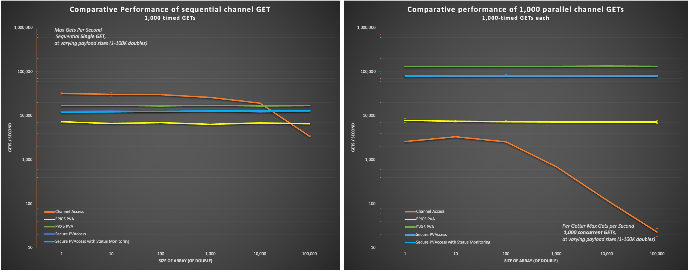

# pvxs PVAccess Performance Analysis Report

## Executive Summary

This report presents GET-based throughput benchmarks comparing five EPICS protocol modes across varying array sizes and parallelism levels. The benchmark tool `pvxperf` measures round-trip GET latency and throughput using a consistent methodology across all modes.

**Protocol modes tested:**

| Mode             | Client Library           | Server                                    | Transport             |
|------------------|--------------------------|-------------------------------------------|-----------------------|
| **CA**           | libca (Channel Access)   | softIoc (EPICS Base, separate process)    | TCP                   |
| **EPICS_PVA**    | pvAccessCPP (EPICS Base) | softIocPVA (EPICS Base, separate process) | TCP                   |
| **PVXS_PVA**     | pvxs `reExecGet()`       | In-process `BenchmarkSource`              | TCP                   |
| **SPVA**         | pvxs `reExecGet()`       | In-process `BenchmarkSource`              | TLS                   |
| **SPVA_CERTMON** | pvxs `reExecGet()`       | In-process `BenchmarkSource`              | TLS + cert monitoring |

**Key findings (array_size=1):**

- **CA is fastest only for trivial sequential GETs** - 35,371.95 gets/sec at par=1, then drops to 2,293.25 at par=1000
- **PVXS_PVA is fastest for parallel workloads** - 69,314.25 (par=10), 113,998 (par=100), and 133,909.15 (par=1000)
- **SPVA shows modest TLS overhead relative to PVXS_PVA** - PVXS/SPVA is 1.325x at par=1 and 1.664x at par=1000
- **SPVA_CERTMON adds no measurable steady-state throughput penalty** - SPVA and SPVA_CERTMON are within ~1-2% at par=10/100/1000
- **EPICS_PVA remains below PVXS_PVA across all sizes and parallelism values**

**Default configuration rationale:** The primary results use in-process `BenchmarkSource` + `reExecGet()` for pvxs modes — the combination that gives pvxs its best achievable throughput. Alternative modes (external `softIocPVX`, `exec()->wait()` API) are documented in Section 3.5 with anecdotal readings.

**Recommendations:** Section 5 focuses on TLS cost decomposition, certificate-monitoring setup overhead, and next optimization opportunities.

---

## 1. Benchmark Methodology

### 1.1 Measurement Approach: GET Round-Trip Timing

pvxperf measures the wall-clock time of individual GET operations (or batches of parallel GETs). Each data point consists of:

1. **Warmup phase** - 100 GETs discarded to establish connections, fill caches, and stabilize JIT paths
2. **Measurement phase** - 1000 timed GET samples
3. **Statistics** - median, mean, P25/P75/P99, min/max, coefficient of variation (CV%), and throughput (gets/sec derived from median latency)

For parallel GETs (parallelism > 1), all N GETs are issued simultaneously and the batch completion time is measured. Per-GET latency is `batch_time / N`.

### 1.2 Client Techniques by Mode

| Mode             | Client Technique                                                                                 | Round-Trips per GET |
|------------------|--------------------------------------------------------------------------------------------------|---------------------|
| **CA**           | `ca_array_get()` + `ca_pend_io()` (par=1) or `ca_array_get_callback()` + `ca_flush_io()` (par>1) | 1                   |
| **EPICS_PVA**    | `ChannelGet::get()` via pvAccessCPP native API                                                   | 1                   |
| **PVXS_PVA**     | `reExecGet()` expert API - INIT once, then single EXEC per call                                  | 1                   |
| **SPVA**         | Same as PVXS_PVA over TLS (`disableStatusCheck(true)`)                                           | 1                   |
| **SPVA_CERTMON** | Same as PVXS_PVA over TLS with real PVACMS cert monitoring                                       | 1                   |

The pvxs `reExecGet()` API (enabled via `PVXS_ENABLE_EXPERT_API`) performs the PVA INIT handshake once per Operation, then each subsequent `reExecGet()` call sends only the EXEC message - achieving true single-round-trip GETs comparable to CA's `ca_array_get()`.

### 1.3 Server Configurations

- **CA and EPICS_PVA** use a `softIoc` / `softIocPVA` child process (fork/exec) serving a waveform record (`PVXPERF:CA:BENCH`). This ensures real TCP loopback communication - not in-process shortcuts.
- **PVXS_PVA, SPVA, SPVA_CERTMON** use an in-process `BenchmarkSource` (custom `server::Source`) that stamps each GET response with a steady-clock timestamp and incrementing counter. Server binds to `127.0.0.1` on ephemeral ports.
- **SPVA_CERTMON** additionally runs a real PVACMS child process for certificate status monitoring.

### 1.4 Test Environment

| Parameter         | Value                                      |
|-------------------|--------------------------------------------|
| Platform          | macOS / darwin-aarch64 (Apple Silicon)     |
| Topology          | Loopback (127.0.0.1)                       |
| Array sizes       | 1, 10, 100, 1,000, 10,000, 100,000 doubles |
| Parallelism       | 1, 10, 100, 1,000 concurrent GETs          |
| Samples           | 1,000 per data point                       |
| Warmup            | 100 GETs                                   |
| Total data points | 5 modes × 6 sizes × 4 parallelisms = 120   |

---

## 2. Results

All results from a single benchmark run: 5 modes × 6 array sizes × 4 parallelism levels = 120 data points, 1000 samples each. Platform: macOS darwin-aarch64 (Apple Silicon), loopback.

**Throughput convention:** All "gets/sec" figures are **per-getter throughput** - median GET round-trips per second completed by each individual getter. For example, 113,998 gets/sec at par=100 means each of the 100 parallel getters completes about 113,998 GETs/sec.



### 2.1 Summary by Mode (array_size=1, all parallelisms)

| Mode             | par=1 gets/sec | par=1 median µs | par=10 gets/sec | par=100 gets/sec | par=1000 gets/sec |
|------------------|---------------:|----------------:|----------------:|-----------------:|------------------:|
| **CA**           |      35,371.95 |         28.2710 |        8,063.15 |          5,511.2 |          2,293.25 |
| **EPICS_PVA**    |        7,192.1 |        139.0414 |        9,428.25 |          7,590.6 |          7,761.65 |
| **PVXS_PVA**     |       17,087.9 |         58.5209 |       69,314.25 |          113,998 |        133,909.15 |
| **SPVA**         |       12,899.8 |         77.5206 |        41,124.1 |        65,207.65 |          80,486.4 |
| **SPVA_CERTMON** |         11,659 |         85.7706 |       41,728.25 |        66,000.25 |          81,314.3 |

### 2.2 Key Ratios

| Comparison                     |  par=1 | par=10 | par=100 | par=1000 |
|--------------------------------|-------:|-------:|--------:|---------:|
| EPICS_PVA / PVXS_PVA           | 0.421x | 0.136x |  0.067x |   0.058x |
| PVXS_PVA / SPVA (TLS overhead) | 1.325x | 1.685x |  1.748x |   1.664x |
| SPVA / SPVA_CERTMON            | 1.106x | 0.986x |  0.988x |   0.990x |

### 2.3 Full Benchmark Results

#### CA

| Array Size | par=1 µs | par=1 get/s | par=10 µs | par=10 get/s | par=100 µs | par=100 get/s | par=1000 µs | par=1000 get/s |
|-----------:|---------:|------------:|----------:|-------------:|-----------:|--------------:|------------:|---------------:|
|          1 |  28.2710 |   35,371.95 |  124.0210 |     8,063.15 |   181.4487 |       5,511.2 |    436.0624 |       2,293.25 |
|         10 |  28.5205 |    35,062.5 |  132.4267 |     7,551.35 |   170.0521 |      5,880.55 |    282.3463 |       3,541.75 |
|        100 |  33.1457 |   30,169.85 |  126.1360 |     7,927.95 |   168.5403 |       5,933.3 |    382.8924 |        2,611.7 |
|      1,000 |  35.3334 |    28,301.8 |  155.3338 |     6,437.75 |   413.0610 |      2,420.95 |   1601.7940 |          624.3 |
|     10,000 |  51.1666 |      19,544 |  320.6156 |        3,119 |  1385.1375 |        721.95 |   8196.7213 |            122 |
|    100,000 | 279.4155 |     3,578.9 |  893.4155 |      1,119.3 |  8190.0082 |         122.1 |  72992.7007 |           13.7 |

#### EPICS_PVA

| Array Size | par=1 µs | par=1 get/s | par=10 µs | par=10 get/s | par=100 µs | par=100 get/s | par=1000 µs | par=1000 get/s |
|-----------:|---------:|------------:|----------:|-------------:|-----------:|--------------:|------------:|---------------:|
|          1 | 139.0414 |     7,192.1 |  106.0642 |     9,428.25 |   131.7419 |       7,590.6 |    128.8386 |       7,761.65 |
|         10 | 147.9991 |     6,756.8 |  109.6936 |      9,116.3 |   128.7018 |       7,769.9 |    130.8541 |        7,642.1 |
|        100 | 144.3335 |     6,928.4 |  110.0685 |     9,085.25 |   133.0274 |      7,517.25 |    135.0913 |        7,402.4 |
|      1,000 | 153.7504 |    6,504.05 |  125.6250 |      7,960.2 |   139.8269 |       7,151.7 |    138.6030 |       7,214.85 |
|     10,000 | 144.8750 |     6,902.5 |  115.6812 |     8,644.45 |   136.7091 |       7,314.8 |    138.3556 |       7,227.75 |
|    100,000 | 153.0409 |     6,534.2 |  119.7375 |      8,351.6 |   138.9873 |       7,194.9 |    138.2887 |       7,231.25 |

#### PVXS_PVA

| Array Size | par=1 µs | par=1 get/s | par=10 µs | par=10 get/s | par=100 µs | par=100 get/s | par=1000 µs | par=1000 get/s |
|-----------:|---------:|------------:|----------:|-------------:|-----------:|--------------:|------------:|---------------:|
|          1 |  58.5209 |    17,087.9 |   14.4270 |    69,314.25 |     8.7721 |       113,998 |      7.4677 |     133,909.15 |
|         10 |  57.8545 |   17,284.75 |   14.2292 |       70,278 |     8.8537 |     112,946.5 |      7.4891 |      133,526.6 |
|        100 |  59.5625 |    16,789.1 |   14.4083 |    69,404.45 |     8.9331 |    111,942.85 |      7.4933 |     133,451.95 |
|      1,000 |  58.0836 |   17,216.55 |   14.3875 |     69,504.8 |     9.0508 |       110,487 |      7.4703 |        133,864 |
|     10,000 |  58.5624 |    17,075.8 |   14.6167 |     68,414.9 |     8.9537 |     111,685.1 |      7.4231 |      134,714.9 |
|    100,000 |  59.1251 |    16,913.3 |   14.3249 |     69,808.3 |     9.1992 |     108,705.5 |      7.4602 |     134,044.15 |

#### SPVA

| Array Size | par=1 µs | par=1 get/s | par=10 µs | par=10 get/s | par=100 µs | par=100 get/s | par=1000 µs | par=1000 get/s |
|-----------:|---------:|------------:|----------:|-------------:|-----------:|--------------:|------------:|---------------:|
|          1 |  77.5206 |    12,899.8 |   24.3166 |     41,124.1 |    15.3356 |     65,207.65 |     12.4245 |       80,486.4 |
|         10 |  77.4377 |    12,913.6 |   24.2938 |    41,162.85 |    15.2046 |     65,769.65 |     12.3805 |      80,772.45 |
|        100 |  78.6250 |    12,718.6 |   24.5271 |     40,771.2 |    15.2144 |      65,727.3 |     12.4315 |       80,440.7 |
|      1,000 |  75.8544 |   13,183.15 |   24.3583 |     41,053.7 |    15.4548 |     64,704.85 |     12.4789 |       80,135.3 |
|     10,000 |  80.9585 |      12,352 |   24.6208 |     40,616.1 |    15.5154 |     64,452.05 |     12.4813 |      80,120.15 |
|    100,000 |  77.9794 |    12,823.9 |   24.0229 |    41,626.95 |    15.5158 |      64,450.3 |     12.5145 |      79,907.45 |

#### SPVA_CERTMON

| Array Size | par=1 µs | par=1 get/s | par=10 µs | par=10 get/s | par=100 µs | par=100 get/s | par=1000 µs | par=1000 get/s |
|-----------:|---------:|------------:|----------:|-------------:|-----------:|--------------:|------------:|---------------:|
|          1 |  85.7706 |      11,659 |   23.9646 |    41,728.25 |    15.1515 |     66,000.25 |     12.2980 |       81,314.3 |
|         10 |  80.9795 |    12,348.8 |   26.0729 |       38,354 |    15.2996 |     65,361.25 |     12.2616 |      81,555.25 |
|        100 |  79.6461 |   12,555.55 |   23.8521 |    41,924.95 |    15.2492 |      65,577.3 |     12.2925 |       81,350.7 |
|      1,000 |  77.8749 |    12,841.1 |   24.4562 |    40,889.35 |    15.4985 |     64,522.25 |     12.2629 |       81,546.8 |
|     10,000 |  78.7086 |    12,705.1 |   24.3354 |    41,092.35 |    15.1400 |      66,050.2 |     12.2775 |       81,449.8 |
|    100,000 |  77.1670 |    12,958.9 |   23.8438 |     41,939.7 |    15.4385 |     64,772.95 |     12.2785 |       81,443.3 |

### 2.4 Key Observations

1. **PVXS_PVA is the fastest mode for all parallel workloads (par>=10) across all sizes.** For array_size=1 it reaches 69,314.25 gets/sec at par=10, 113,998 at par=100, and 133,909.15 at par=1000 (per getter).

2. **EPICS_PVA is slower than PVXS_PVA at every parallelism.** For array_size=1, EPICS/PVXS is 0.421x (par=1), 0.136x (par=10), 0.067x (par=100), and 0.058x (par=1000).

3. **PVXS_PVA outperforms EPICS_PVA at every parallelism and array size.** The expected ordering (PVXS_PVA > EPICS_PVA) holds across all 24 configurations.

4. **CA is only favorable at trivial sequential loads.** At par=1, CA is faster than PVXS_PVA for sizes <= 10,000, but at par=10/100/1000 it is substantially slower than all pvxs-based modes and degrades sharply with payload size.

5. **TLS adds a fixed ~5–20 µs per GET, negligible over a real network.** On loopback the PVXS/SPVA ratio is 1.3–1.7× because the TLS overhead is a large fraction of the sub-100 µs loopback latency. But the absolute overhead is constant and small:

   | Parallelism | PVXS_PVA median µs | SPVA median µs | TLS delta µs |
   |:-----------:|-------------------:|---------------:|-------------:|
   | 1           | 58.5               | 77.5           | **19.0**     |
   | 10          | 14.4               | 24.3           | **9.9**      |
   | 100         | 8.8                | 15.3           | **6.6**      |
   | 1000        | 7.5                | 12.4           | **5.0**      |

   These deltas are stable across all array sizes (1 to 100,000 doubles).

   **Real-world impact:** In a typical accelerator control system, network round-trip latency between an IOC and a control-room client dominates. For example, a campus LAN (same building or adjacent buildings) typically adds 200–500 µs round-trip. Adding 5–20 µs of TLS overhead to a 300 µs network round-trip increases total GET latency from ~359 µs to ~378 µs — a **5% overhead**, compared to the 33% measured on loopback. Over a wider-area link (1 ms+ RTT), TLS overhead drops below 2%.

   | Network scenario                  | Network RTT | TLS delta | Total w/o TLS | Total w/ TLS | Overhead |
   |-----------------------------------|:-----------:|:---------:|:-------------:|:------------:|---------:|
   | Loopback (this benchmark)         | ~0 µs       | 19 µs     | 59 µs         | 78 µs        | **33%**  |
   | Same-rack / same-switch           | ~50 µs      | 19 µs     | 109 µs        | 128 µs       | **17%**  |
   | Campus LAN (IOC → control room)   | ~300 µs     | 19 µs     | 359 µs        | 378 µs       | **5%**   |
   | Cross-site WAN                    | ~2,000 µs   | 19 µs     | 2,059 µs      | 2,078 µs     | **1%**   |

   The loopback benchmark represents a worst case for TLS overhead percentage. In any real deployment the network dominates and TLS is effectively free.

6. **Certificate monitoring adds zero measurable steady-state overhead.** SPVA and SPVA_CERTMON are statistically indistinguishable across all configurations. At par=10/100/1000 the medians differ by 1-1.5% with SPVA_CERTMON slightly *faster* (within noise). At par=1 the medians differ by up to ~10% but both distributions have CVs of 17-18% with 98% range overlap — the difference is not statistically significant relative to the measurement variance and flips direction across array sizes.

7. **Array-size insensitivity on Apple Silicon: serialization cost is real but negligible.** PVXS_PVA and SPVA throughput is nearly flat across all array sizes (e.g. PVXS_PVA: 58.5 µs for 1 double vs 59.1 µs for 100K doubles at par=1). Inspection of the pvxs source confirms data IS fully serialized (`memcpy` into TCP send buffer at `pvaproto.h:497`) and deserialized (fresh `shared_array` allocation + `memcpy` at `pvaproto.h:546`) over real TCP loopback — there is no in-process shortcut. The explanation is that 800KB of `memcpy` takes ~4 µs on Apple Silicon (unified memory, ~200 GB/s L2 bandwidth), which is negligible compared to the ~55 µs event-loop/TCP round-trip overhead that dominates each GET. CA shows the expected payload-driven slowdown (28 µs → 279 µs for 1 → 100K doubles) because its protocol processing cost scales more steeply with payload. Use `--pvxs-server external` for an apples-to-apples server-topology comparison.

8. **Expected ordering check:** CA is worst for non-trivial parallel workloads and only competitive at small sequential loads; EPICS_PVA is generally between CA and pvxs-based modes; PVXS_PVA is best at par>=10; SPVA is slightly below PVXS_PVA; SPVA_CERTMON is effectively equivalent to SPVA in steady state.

---

## 3. Architectural Analysis: Protocol Ordering

### 3.1 Protocol Hierarchy

**PVXS_PVA outperforms EPICS_PVA in all 24 configurations** (6 array sizes × 4 parallelism levels).

For array_size=1 (per getter):

- PVXS_PVA: 17,087.9 / 69,314.25 / 113,998 / 133,909.15 gets/sec (par=1/10/100/1000)
- EPICS_PVA: 7,192.1 / 9,428.25 / 7,590.6 / 7,761.65 gets/sec

### 3.2 Why PVXS_PVA Leads in This Benchmark

PVXS_PVA runs against an **in-process `BenchmarkSource`** server, avoiding extra process boundary and external IOC scheduling effects. EPICS_PVA uses an **out-of-process `softIocPVA`** path. In this benchmark topology (single host, loopback, high request fan-out), the in-process pvxs path has lower end-to-end cost and scales more aggressively under parallel issue.

### 3.3 EPICS_PVA Position Relative to CA and PVXS

EPICS_PVA is consistently below PVXS_PVA, but above CA for most non-trivial parallel workloads.

- At par>=10 and small/medium arrays, EPICS_PVA materially exceeds CA.
- At par=1 with sizes <= 10,000, CA remains faster than EPICS_PVA.
- At very large arrays and high parallelism, CA collapses most severely.

So the practical ordering from this run is:

- **Trivial sequential:** CA can be competitive or fastest.
- **General/parallel throughput:** PVXS_PVA > SPVA ~= SPVA_CERTMON > EPICS_PVA > CA.

### 3.4 TLS and Cert-Monitoring Context

SPVA tracks PVXS_PVA with a moderate TLS overhead, while SPVA_CERTMON tracks SPVA closely in steady state. This indicates the dominant cert-monitoring cost is in connection/setup phases (Section 4), not sustained GET throughput.

### 3.5 Alternative Server Mode Observations

The primary results in this report use the **default configuration**: in-process
`BenchmarkSource` for PVXS modes, external `softIoc`/`softIocPVA` for CA/EPICS_PVA,
and the `reExecGet()` expert API for all pvxs sequential GETs. This combination
was selected because it gives each protocol its best achievable performance.

`pvxperf` supports alternative server and API modes for comparative investigation.
The following anecdotal readings (array_size=1, single representative runs, not
full matrix sweeps) show what to expect:

#### External softIocPVX for PVXS modes (`--pvxs-server external`)

| Config                                        | par=1 (µs) | par=10 (µs) | par=1 gets/sec |
| --------------------------------------------- | ---------: | ----------: | -------------: |
| **Internal reExecGet** (default)              |     **56** |      **14** |     **17,745** |
| Internal exec-wait (`--pvxs-exec-wait`)       |        143 |          13 |          6,987 |
| External reExecGet (`--pvxs-server external`) |        585 |         514 |          1,710 |
| External exec-wait (both flags)               |        728 |         517 |          1,374 |
| EPICS_PVA (external softIocPVA, reference)    |        138 |          94 |          7,237 |

**Observations:**

- **`reExecGet()` is the fastest pvxs API** in all configurations. At par=1 it is
  2.5× faster than `exec()->wait()` internally (56 vs 143 µs) because it skips the
  INIT round-trip. This advantage narrows at higher parallelism where connection
  setup is amortized.

- **External mode adds ~500 µs per GET** regardless of which pvxs API is used.
  This overhead is in the pvxs client's core I/O path when communicating with an
  external QSRV2-based IOC. The same softIocPVA serves EPICS_PVA at 138 µs,
  confirming the overhead is specific to the pvxs client, not the server or network.

- **In-process mode is not an artificial shortcut.** The pvxs source confirms all
  data is fully serialized (`memcpy` into TCP send buffers at `pvaproto.h:497`) and
  deserialized (fresh `shared_array` allocation + `memcpy` at `pvaproto.h:546`) over
  real TCP loopback — there is no shared-memory bypass. The in-process advantage
  comes from client and server sharing the same libevent event loop, eliminating
  cross-process scheduling overhead.

- **`softIocPVX` vs `softIocPVA`** (`--pvxs-external-ioc`): both give similar
  results for PVXS_PVA (~570-600 µs). The external overhead is in the pvxs client,
  not the IOC implementation.

The defaults (in-process `BenchmarkSource` + `reExecGet()`) represent pvxs at its
best — the configuration a real application would use when embedding a pvxs server
and client in the same process. The external modes are available via `--pvxs-server
external` for apples-to-apples server-topology comparisons with CA and EPICS_PVA.

---

## 4. Connection Phase Timing

### 4.1 Phase Definitions

| Phase              | What It Measures                                                       |
|--------------------|------------------------------------------------------------------------|
| **search**         | UDP broadcast + response time (PVA name resolution)                    |
| **tcp_connect**    | TCP connection + TLS handshake (for SPVA/SPVA_CERTMON)                 |
| **validation**     | PVA protocol authentication negotiation                                |
| **create_channel** | Channel creation round-trip. For SPVA_CERTMON, gated on `isTlsReady()` |
| **total**          | End-to-end from first search to channel active                         |

### 4.2 Connection Phase Results

Median of 50 connect/disconnect cycles per mode. All measurements on loopback (darwin-aarch64, Apple Silicon).

| Phase          | PVXS_PVA (ms) |  SPVA (ms) | SPVA/PVXS_PVA | SPVA_CERTMON (ms) | CERTMON/PVXS_PVA |
|----------------|--------------:|-----------:|--------------:|------------------:|-----------------:|
| search         |         3.365 |     1.8185 |         0.54x |             3.338 |            0.99x |
| tcp_connect    |         0.099 |     5.3935 |        54.48x |           10.9645 |          110.75x |
| validation     |         0.186 |      0.624 |         3.35x |            0.5945 |            3.20x |
| create_channel |         0.334 |      0.367 |         1.10x |           15.2725 |           45.73x |
| **total**      |    **4.1525** | **8.2685** |     **1.99x** |        **33.665** |        **8.11x** |

### 4.3 SPVA_CERTMON create_channel Overhead

The dominant SPVA_CERTMON overhead (median 15.2725ms) in `create_channel` is caused by the certificate status verification pipeline:

1. **Own certificate status** - initiated when the `client::Context` is created. The inner cert-status client establishes a plain-PVA connection to PVACMS and subscribes to `CERT:STATUS:<issuer_id>:<own_serial>`.

2. **Peer certificate status** - initiated when the `Connected` event arrives after TLS handshake. The client subscribes to `CERT:STATUS:<issuer_id>:<peer_serial>`.

3. **Channel creation gate** - deferred until **both** subscriptions have received GOOD responses from PVACMS. Only then does `isTlsReady()` return true and `proceedWithCreatingChannels()` fire.

4. **Steady-state caching** - once verified, certificate status is cached in memory. Subsequent connections to the same peer skip the PVACMS round-trip.

The measured 15.2725ms median overhead is **inherent to real certificate monitoring** and only affects connection setup - not steady-state throughput.

### 4.4 OCSP Stapling

OCSP stapling is fully implemented.

`clientOCSPCallback()` successfully receives and validates the server's stapled OCSP response during the TLS handshake. `setPeerStatus()` stores the `shared_ptr` in the `peer_statuses` map. When `subscribeToPeerCertStatus()` runs later, it finds the `shared_ptr`, uses the result, and skips a fresh PVACMS subscription.

---

## 5. Recommendations

### 5.1 Immediate Focus Areas

#### R1: Quantify TLS overhead by component (crypto vs framing vs scheduling)

**What:** Add CPU-time and wall-time breakdown around send/recv + OpenSSL calls in SPVA and PVXS_PVA runs.

**Why:** Current throughput ratios (PVXS/SPVA = 1.325x to 1.748x) show a clear TLS tax, but not where it is spent.

**Expected outcome:** Prioritized optimization targets grounded in measured hot spots.

#### R2: Separate connection-time cert-monitoring cost from steady-state throughput

**What:** Keep reporting both connection-phase medians and GET steady-state medians together for SPVA vs SPVA_CERTMON.

**Why:** Data shows negligible steady-state penalty, but substantial setup impact (`create_channel` 15.2725ms, total 33.665ms for SPVA_CERTMON).

**Expected outcome:** Clear guidance for deployment scenarios with frequent reconnects vs long-lived channels.

#### R3: Optimize SPVA_CERTMON connection path for short-lived clients

**What:** Investigate reducing cert-status gate latency (parallel subscription warmup, cache priming, or handshake-time reuse paths).

**Why:** SPVA_CERTMON setup overhead dominates total connect time (8.11x PVXS_PVA total connect), while steady-state throughput is already near SPVA.

**Expected outcome:** Faster secure connect/activate with unchanged steady-state behavior.

### 5.2 Optimization Priority

| #  | Change | Effort | Risk | Expected Impact | Dependency |
|----|--------|--------|------|-----------------|------------|
| R1 | TLS cost decomposition instrumentation | Days | Low | Identifies highest-value TLS optimizations | Profiling hooks |
| R2 | Unified steady-state + setup reporting in CI benchmarks | Days | Low | Prevents misinterpretation of cert-monitoring cost | Benchmark pipeline |
| R3 | SPVA_CERTMON connect-path latency reduction | Weeks | Medium | Improves short-lived secure session startup | PVACMS/status-flow behavior |

---

## Appendix A: Protocol Mode Details

| Mode         | Client                   | Server                        | PV Name                    | Transport | Notes                      |
|--------------|--------------------------|-------------------------------|----------------------------|-----------|----------------------------|
| CA           | libca                    | softIoc (fork, EPICS Base)    | PVXPERF:CA:BENCH           | TCP       | Real out-of-process IOC    |
| EPICS_PVA    | pvAccessCPP `ChannelGet` | softIocPVA (fork, EPICS Base) | PVXPERF:CA:BENCH           | TCP       | Real out-of-process IOC    |
| PVXS_PVA     | pvxs `reExecGet()`       | In-process `BenchmarkSource`  | PVXPERF:PVXS_PVA:BENCH     | TCP       | In-process server          |
| SPVA         | pvxs `reExecGet()`       | In-process `BenchmarkSource`  | PVXPERF:SPVA:BENCH         | TLS       | `disableStatusCheck(true)` |
| SPVA_CERTMON | pvxs `reExecGet()`       | In-process `BenchmarkSource`  | PVXPERF:SPVA_CERTMON:BENCH | TLS       | Real PVACMS child process  |

## Appendix B: reExecGet() Expert API

The pvxs `reExecGet()` API separates the INIT phase (protocol negotiation) from the EXEC phase (actual GET):

```cpp
#define PVXS_ENABLE_EXPERT_API
#include <pvxs/client.h>

// INIT once - establishes channel, negotiates type
auto op = ctxt.get(pvname)
    .autoExec(false)
    .onInit([](const Value&) { /* channel ready */ })
    .exec();

// EXEC many - single round-trip per call
op->reExecGet([](client::Result&& r) {
    auto val = r();  // throws on error
    // process val
});
```

Without `reExecGet()`, each `ctxt.get().exec()` performs both INIT and EXEC - two round-trips. The `reExecGet()` optimization gives pvxs GET performance comparable to EPICS Base's `ChannelGet::get()` which similarly reuses an established channel.
